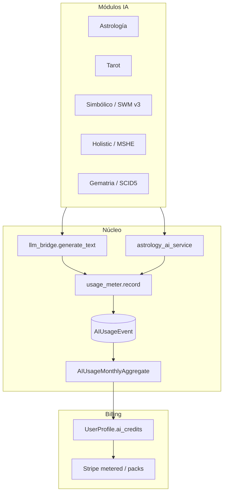

# AI Usage Metering — Implementación transversal (todos los módulos)

**Fecha:** 2026-06-10  
**Estado:** ✅ **Fase 1 + Fase 2 FE + cableado completo** (2026-06-10) — incluye snippets, gematria, tarot SWM; deploy con `patch-ai-metering-env.sh`  
**Autoridad:** Complementa `docs/00_SOURCE_OF_TRUTH/SOURCE_OF_TRUTH.md` (gobernanza IA no clínica)  
**Relacionado:** [AUDIT_MODULOS_IA_2026-06-05.md](./AUDIT_MODULOS_IA_2026-06-05.md), [MULTI_AI_SERVICE_ARCHITECTURE.md](../MULTI_AI_SERVICE_ARCHITECTURE.md), [AI_INTEGRATION_GUIDE.md](../AI_INTEGRATION_GUIDE.md), [planai.md](../../planai.md)

---

## 1. Problema de negocio

Hoy la suscripción terapeuta es **plana** (~49 €/mes, “análisis ilimitados” en `tonyblanco-app/lib/stripe-config.ts`). El límite operativo real es solo **número de pacientes** (`UserProfile.max_patients`), no consumo de IA.

| Terapeuta | Pacientes | Uso IA mensual típico | Coste API estimado (Flash) | Paga hoy |
|-----------|-----------|------------------------|----------------------------|----------|
| A | 100 | 2 capas nuevas × paciente | ~6–10 € | 49 € |
| B | 10 | 2 capas nuevas × paciente | ~0,6–1 € | 49 € |

El terapeuta B **subsidia** al A. En pruebas reales y con **informes largos** (PR2 PDF / síntesis multi-capa), la desigualdad y el riesgo de margen aumentan.

**Objetivo:** modelo **base + créditos AI incluidos + overage** medido por terapeuta, con ledger auditable por llamada.

---

## 2. Modelo comercial propuesto (híbrido)

```
Cuota base (plataforma)     → acceso, pacientes, historial, soporte
Créditos AI incluidos       → presupuesto en € de API/mes (no “tokens ilimitados”)
Overage                     → packs o facturación metered cuando se agota el incluido
```

### Planes de referencia (ajustar tras Fase 2 con datos reales)

| Plan | Base/mes | Crédito AI incluido | Pacientes | Overage |
|------|----------|---------------------|-----------|---------|
| Starter | 29 € | 2 € | 15 | Pack 5 € |
| Pro | 49 € | 8 € | 50 | €/token efectivo |
| Scale | 79 € | 20 € | 200 | negociado |

**Reglas:**
- Regenerar interpretación existente **cuesta** (o requiere confirmación + débito).
- Informe largo / síntesis premium usa `task_type` con **peso mayor** (modelo más caro opcional).
- Caché BD existente (`AstrologyAIInterpretation`, etc.) evita doble cobro si no se regenera.

---

## 3. Inventario — todos los módulos que usan IA

Leyenda **Bridge:** `llm_bridge.generate_text` → `multi_ai_service` (fallback).  
**Direct:** proveedor propio sin ledger hoy.

| Módulo | `task_type` | Endpoint / disparador | Archivo(s) | Bridge | max_tokens típ. | Billable |
|--------|-------------|----------------------|------------|--------|-----------------|----------|
| **Router unificado** | — | `GET /api/ai/status/` | `api/ai/llm_bridge.py` | — | — | No |
| **AI genérico** | `ai.generate` | `POST /api/ai/generate/` | `api/ai/governed_views.py` | ✅ | 512–2048 | Sí |
| **Query holística** | `ai.holistic_query` | `POST /api/ai/holistic-query/` | `api/ai_views.py` | ✅ | 512 | Sí |
| **Cábala gobernada** | `ai.kabbalah_interpret` | `POST /api/ai/kabbalah/interpret/` | `api/ai/governed_views.py` | ✅ | configurable | Sí |
| **Plan terapeuta** | `holistic.therapist_plan` | `POST` (views paciente) | `api/utils/holistic_ai.py` | ✅ | 2048 | Sí |
| **Síntesis MSHE** | `holistic.synthesis` | `POST /api/analysis-records/holistic-synthesis/` | `api/holistic_synthesis_engine.py` | ✅ | 1536 | Sí |
| **SCID-5 asistente** | `clinical.scid5_assist` | `POST /api/analysis-records/scid5-ai-assistant/` | `api/analysis_views.py` | ❌ Gemini directo | ~2048 | Sí |
| **Intérprete simbólico** | `symbolic.tree_interpret` | `POST /api/symbolic-interpreter/generate/` | `api/utils/symbolic_interpreter_ai.py` | ✅ | 1024 | Sí |
| **Tarot SWM legacy** | `tarot.swm_reading` | vía `tarot_service` | `api/utils/tarot_service.py` | ✅ | 2048 | Sí |
| **Tarot holístico** | `tarot.holistic_card` / `tarot.holistic_spread` | `POST /api/ai/tarot/interpretCard|Spread/` | `api/tarot_holistic_views.py` | ❌ `AstrologyAIService` | ~2048 | Sí |
| **SWM v3 lecturas** | `swm_v3.symbolic_reading` | `POST /api/swm-v3/symbolic-readings/` | `symbolic/swm_v3/views.py` | ✅ `generate_with_fallback` | 512 | Sí |
| **Gematria** | `kabbalah.gematria` | `POST /api/gematria/interpret/` | `api/utils/gematria_ai.py` | ❌ Gemini directo | ~1024 | Sí |
| **Cábala legacy** | `kabbalah.legacy_interpret` | análisis cabalístico | `api/ai_interpreter.py` | ❌ Gemini directo | variable | Sí |
| **Astrología — natal** | `astrology.natal` | `POST /api/astrology/interpret/natal/` | `api/astrology_ai_views.py` | ❌ `astrology_ai_service` | 8192 | Sí |
| **Astrología — tránsitos** | `astrology.transits` | `.../transits/` | idem | ❌ | 8192 | Sí |
| **Astrología — progresiones** | `astrology.progressions` | `.../progressions/` | idem | ❌ | 8192 | Sí |
| **Astrología — retorno solar** | `astrology.solar_return` | `.../solar-return/` | idem | ❌ | 8192 | Sí |
| **Astrología — situación** | `astrology.situation` | `.../situation/` | idem | ❌ | 4096 | Sí |
| **Astrología — psicológico** | `astrology.psychological` | `.../psychological/` | idem | ❌ | 8192 | Sí |
| **Astrología — snippets** | `astrology.snippet` | al cargar capa (flag) | `api/astrology_kerykeion/ai_snippets.py` | ✅ | 220 | Sí |
| **Informe sesión (PR1)** | `astrology.session_report` | snapshot BD | `api/astrology_report_service.py` | — | **0** | No |
| **Informe largo PDF (PR2)** | `astrology.long_report` | futuro | TBD | Bridge + premium | 12k–40k | Sí (alto) |
| **Bioemocional assist** | `bioemotional.assist_draft` | Fase 2 planai | `api/ai/governed_views.py` | ✅ | configurable | Sí |
| **Process Memory embed** | `memory.embedding` | embeddings Ollama | settings `PROCESS_MEMORY_*` | Ollama | — | Opcional* |

\* Embeddings locales (Ollama) no facturan API cloud; registrar por volumen para capacidad servidor.

### Deuda técnica (pre-metering)

1. **`token_count`** en `AstrologyAIInterpretation` existe pero **no se rellena**.
2. Rutas **Direct** no pasan por `llm_bridge` → sin métricas unificadas ni fallback.
3. `AI_PROVIDER=free_first` prioriza Groq → límite free (429) en prod; metering debe ir con **Gemini Flash primario** en paid tier.

---

## 4. Estimación de coste por token (referencia 2026)

Precios orientativos **paid tier** (verificar en consola del proveedor):

| Modelo | Input / 1M | Output / 1M | Uso recomendado |
|--------|--------------|-------------|-----------------|
| `gemini-2.5-flash` | ~0,15 USD | ~0,60 USD | Capas, snippets, informe estándar |
| `gpt-4o-mini` | ~0,15 USD | ~0,60 USD | Fallback estable |
| `claude-sonnet-4` | ~3 USD | ~15 USD | Informe largo premium (opcional) |
| Groq free | $0 | $0 | Solo dev; techo TPD |

### Coste por acción (Flash, orden de magnitud)

| Acción | Tokens totales aprox. | Coste EUR |
|--------|----------------------|-----------|
| Snippet capa | ~500 | <0,001 € |
| Capa astrología (natal, etc.) | ~6.000–10.000 | 0,003–0,008 € |
| Tarot carta / spread | ~2.000–4.000 | 0,001–0,003 € |
| **Informe largo síntesis** | ~30.000–50.000 | 0,02–0,08 € (Flash) / 0,15–0,35 € (Sonnet) |

Función de coste en código:

```python
def estimate_cost_eur(provider: str, model: str, prompt_tokens: int, completion_tokens: int) -> Decimal:
    rates = get_rate_snapshot(provider, model)  # tabla versionada por fecha
    usd = (prompt_tokens * rates.input_per_m + completion_tokens * rates.output_per_m) / 1_000_000
    return Decimal(usd * EUR_USD_RATE).quantize(Decimal("0.0001"))
```

---

## 5. Arquitectura técnica

### 5.1 Principio: un solo punto de registro

Toda inferencia cloud **debe** pasar por `api/ai/usage_meter.py` (nuevo), invocado desde:

1. `llm_bridge.generate_text` (ya centraliza ~60% del tráfico)
2. `astrology_ai_service._generate_*` (astrología + tarot holístico)
3. `gematria_ai`, `GeminiInterpreter`, `SCID5Assistant` (migrar a bridge o wrapper)



### 5.2 Modelo de datos

#### `AIUsageEvent` (append-only)

| Campo | Tipo | Descripción |
|-------|------|-------------|
| `id` | UUID | |
| `therapist` | FK `User` | Quien paga (siempre terapeuta autenticado) |
| `patient` | FK `Patient` nullable | Contexto clínico |
| `task_type` | CharField | Catálogo sección 3 |
| `provider` | CharField | groq, gemini, openai, anthropic, ollama |
| `model` | CharField | ej. gemini-2.5-flash |
| `prompt_tokens` | int | Del response.usage |
| `completion_tokens` | int | Del response.usage |
| `total_tokens` | int | |
| `estimated_cost_eur` | Decimal(10,4) | Snapshot tarifa |
| `billing_period` | CharField | `YYYY-MM` |
| `source_type` | CharField | astrology_interpretation, tarot_session, … |
| `source_id` | CharField nullable | FK lógica |
| `cached_hit` | bool | True si sirvió caché (no debería crear evento) |
| `created_at` | DateTime | |

Índices: `(therapist, billing_period)`, `(task_type, created_at)`, `(patient, created_at)`.

#### `AIUsageMonthlyAggregate` (materializado, cron o signal)

| Campo | Descripción |
|-------|-------------|
| `therapist` + `billing_period` | unique together |
| `total_tokens` | |
| `total_cost_eur` | |
| `included_credit_eur` | Del plan |
| `overage_eur` | max(0, total - included) |
| `breakdown_json` | Por task_type |

#### Extensión `UserProfile`

```python
ai_included_credit_eur = DecimalField(default=8.00)  # según plan
ai_prepaid_credit_eur = DecimalField(default=0)      # packs
ai_hard_limit_eur = DecimalField(null=True)          # tope opcional
ai_metering_enforced = BooleanField(default=False)   # rollout gradual
```

#### Rellenar `AstrologyAIInterpretation.token_count`

Al crear interpretación, copiar `total_tokens` del evento ledger vinculado.

### 5.3 Servicio `usage_meter.py`

```python
@dataclass
class UsageRecordInput:
    therapist: User
    patient: Patient | None
    task_type: str
    provider: str
    model: str
    prompt_tokens: int
    completion_tokens: int
    source_type: str = ""
    source_id: str = ""

def record_usage(data: UsageRecordInput) -> AIUsageEvent: ...

def check_quota(therapist: UserProfile) -> QuotaStatus:
    """remaining_eur, allowed, message"""

def enforce_quota(therapist: UserProfile) -> None:
    """Raises AIQuotaExceeded if metering enforced and over limit"""
```

**Integración en `llm_bridge`:**

```python
result = generate_with_fallback(...)
if result["success"] and hasattr(request_context, "therapist"):
    record_usage_from_llm_result(request_context, result, task_type=...)
return result
```

Pasar `task_type` y contexto vía parámetro opcional en `generate_text(..., usage_context=UsageContext(...))`.

### 5.4 API nueva (terapeuta)

| Método | Ruta | Descripción |
|--------|------|-------------|
| GET | `/api/therapist/ai-usage/` | Resumen mes actual + desglose |
| GET | `/api/therapist/ai-usage/history/` | Últimos N eventos |
| GET | `/api/therapist/ai-usage/periods/` | Agregados por mes |
| POST | `/api/therapist/ai-credits/purchase/` | Pack Stripe (Fase 4) |

Respuesta ejemplo:

```json
{
  "billing_period": "2026-06",
  "included_credit_eur": "8.00",
  "consumed_eur": "3.42",
  "remaining_eur": "4.58",
  "overage_eur": "0.00",
  "total_tokens": 412000,
  "by_task_type": {
    "astrology.natal": { "count": 12, "cost_eur": "0.09" },
    "astrology.snippet": { "count": 340, "cost_eur": "0.28" }
  },
  "metering_enforced": false
}
```

### 5.5 Enforcement (Fase 3)

Antes de cada llamada billable:

1. `quota = check_quota(therapist)`
2. Si `metering_enforced` y `quota.remaining_eur <= 0` → **402 Payment Required** + `GuidedBlock` en FE
3. Si regeneración: verificar `force_regenerate=true` → siempre debita

Códigos HTTP:

| Código | Significado |
|--------|-------------|
| 402 | Crédito AI agotado |
| 429 | Rate limit proveedor (ya existe en astrología) |
| 503 | Sin proveedor configurado |

### 5.6 Frontend

- Panel en dashboard terapeuta: barra consumo / créditos
- En `AIInterpretationPanel`: mostrar coste estimado al regenerar
- `GuidedBlock` variant `locked` para cuota agotada (regla CLAUDE.md / AGENTS.md)

---

## 6. Fases de implementación

| Fase | Alcance | Entregable | Riesgo |
|------|---------|------------|--------|
| **1 — Medir** | Modelo + `record_usage` + bridge + astrología | Ledger poblado; sin bloqueo | Bajo |
| **2 — Mostrar** | API usage + widget FE | Terapeutas ven consumo real | Bajo |
| **3 — Ajustar** | Calibrar créditos incluidos con P50/P95 prod | Actualizar planes Stripe | Medio |
| **4 — Cobrar** | Stripe metered / packs + `metering_enforced=True` | Overage facturado | Alto (legal/UX) |

**Orden obligatorio:** 1 → 2 → (esperar datos) → 3 → 4.

### Fase 1 — checklist por archivo

- [x] `api/models_ai_usage.py` — modelos + migración `0096`
- [x] `api/ai/usage_meter.py` — record, quota, rates
- [x] `api/ai/llm_usage.py` — extracción tokens (sin circular imports)
- [x] `api/ai/llm_bridge.py` — hook + `usage_context`
- [x] `api/astrology_ai_service.py` — `GenerationResult` + usage Gemini/Groq/Ollama
- [x] `api/astrology_ai_views.py` — ledger + `token_count` en guardados
- [x] `api/utils/multi_ai_service.py` — `prompt_tokens`, `completion_tokens` en result
- [x] `api/ai_usage_views.py` + URLs — `GET /api/therapist/ai-usage/`, `.../history/`
- [x] `core/settings.py` — `AI_METERING_*`
- [x] Tests: `api/tests/test_ai_usage_meter.py` (11 tests OK)
- [ ] `api/tarot_holistic_views.py` — registrar usage (solo fix `.text` hecho)
- [ ] `api/utils/gematria_ai.py` — migrar a bridge
- [ ] `api/ai_interpreter.py` — migrar a bridge
- [ ] `api/analysis_views.py` (SCID5) — migrar a bridge
- [ ] `symbolic/swm_v3/views.py` — pasar `usage_context`

### Fase 2 — checklist

- [ ] `api/ai_usage_views.py` + urls
- [ ] `tonyblanco-app/lib/ai-usage-api.ts`
- [ ] Componente `TherapistAIUsagePanel.tsx`

### Fase 4 — Stripe

- Producto base (recurring) + price metered `ai_overage` O one-time `ai_credit_pack_5eur`
- Webhook: acreditar `ai_prepaid_credit_eur`
- Actualizar `stripe-config.ts` copy: quitar “análisis ilimitados” → “créditos AI incluidos”

---

## 7. Variables de entorno

Añadir en `deploy/studios33/env.example` y prod:

```env
# Metering (Fase 1+)
AI_METERING_ENABLED=true          # registrar eventos
AI_METERING_ENFORCED=false        # true = bloquear sin crédito (Fase 4)
AI_DEFAULT_INCLUDED_CREDIT_EUR=8.00
AI_EUR_USD_RATE=0.92              # snapshot manual o API FX
AI_OVERAGE_ALLOWED=true

# Prod: proveedor primario rentable
AI_PROVIDER=gemini
GEMINI_MODEL=gemini-2.5-flash
OPENAI_API_KEY=                   # fallback
```

---

## 8. Gobernanza y compliance

- Ledger guarda **metadatos de uso**, no contenido de prompts (PHI minimization).
- `task_type` + `source_id` permiten auditoría sin almacenar texto generado.
- Informes clínicos: disclaimer simbólico existente no cambia.
- Admin Django: vista read-only de `AIUsageEvent` por terapeuta.

---

## 9. Criterios de aceptación (Fase 1)

1. Cada `POST /api/astrology/interpret/*` exitoso crea exactamente un `AIUsageEvent`.
2. `GET /api/therapist/ai-usage/` devuelve totales coherentes con suma de eventos.
3. Snippets con flag on registran `astrology.snippet` (<1 €/mes en uso normal).
4. Informe sesión PR1 **no** crea eventos.
5. Tests unitarios pasan sin llamadas HTTP externas.
6. Documentación enlazada actualizada (este doc + guías).

---

## 10. Referencias cruzadas

| Documento | Cambio |
|-----------|--------|
| [MULTI_AI_SERVICE_ARCHITECTURE.md](../MULTI_AI_SERVICE_ARCHITECTURE.md) | Metering + prioridad Gemini prod |
| [AI_INTEGRATION_GUIDE.md](../AI_INTEGRATION_GUIDE.md) | Obligatorio `usage_context` en módulos nuevos |
| [ASTROLOGY_AI_PERSISTENCE_GUIDE.md](../ASTROLOGY_AI_PERSISTENCE_GUIDE.md) | `token_count` vía ledger |
| [planai/PHASE_0_UNIFIED_LLM_ROUTER.md](./planai/PHASE_0_UNIFIED_LLM_ROUTER.md) | Fase 0.5 metering |
| [AUDIT_MODULOS_IA_2026-06-05.md](./AUDIT_MODULOS_IA_2026-06-05.md) | §3.5 ledger |
| `deploy/studios33/env.example` | Variables metering |
| `tonyblanco-app/lib/stripe-config.ts` | Copy planes (Fase 4) |

---

**Próximo paso de código:** implementar Fase 1 (`AIUsageEvent` + hook en `llm_bridge` + astrología).