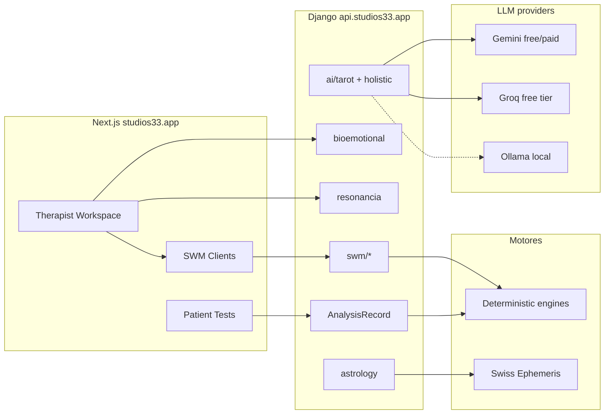

# Auditoría — Módulos, wiring, conectividad e IA en servidor

**Fecha:** 2026-06-05  
**Alcance:** Funcionalidad entre módulos, APIs, frontend↔backend, implementación IA, recursos gratuitos en Hetzner  
**Producción:** `studios33.app` / `api.studios33.app` (`/opt/studio33`)  
**Plan arquitectónico IA:** [planai.md](../../planai.md) (raíz del repo)

---

## 1. Resumen ejecutivo

| Área | Veredicto |
|------|-----------|
| **Núcleo clínico (AnalysisRecord + tests)** | Motor y adapters **implementados**; consumo UI **parcial** |
| **SWM (MCMI-4, Tarot, Cábala, Transgeneracional)** | Backend **maduro**; frontend **cableado** vía `lib/api/swm/*` |
| **Bio-emocional** | API REST **completa**; **sin llamadas IA** en `api/bioemotional/` |
| **Resonancia ancestral** | API + UI grande; persistencia **parcial** |
| **IA en servidor** | **Multi-proveedor** (Gemini → OpenAI → Groq → Ollama); **no hay aprendizaje** ni memoria de procesos unificada |
| **Entrenamiento / fine-tune** | **No existe** en el repo |
| **Recursos free en servidor** | Groq + Gemini (keys en `.env`); Ollama **configurado pero no desplegado** en Hetzner |

**Conclusión:** La plataforma es fuerte en **cálculo determinista + SWM persistido**. La IA está **fragmentada** (Gemini-only en varios sitios, `multi_ai` solo en SWM-v3 y Tarot holístico). Falta una **capa unificada de memoria de proceso** y gobernanza común antes de “entrenar” cualquier modelo.

---

## 2. Mapa de módulos — hecho vs falta

### 2.1 Leyenda

| Estado | Significado |
|--------|-------------|
| ✅ Wired | UI llama API real y persiste |
| 🟡 Partial | API o UI a medias, mocks, rutas duplicadas |
| ❌ Stub | Placeholder, mock o `implemented: false` |
| ⛔ Frozen | Código existe pero bloqueado por gobernanza |

### 2.2 Tabla por módulo

| Módulo | Backend | Frontend | IA servidor | Wiring | Notas |
|--------|---------|----------|-------------|--------|-------|
| **Auth + roles** | ✅ | ✅ | — | ✅ | Token, Turnstile, Google (2026-06-05) |
| **AnalysisRecord** | ✅ `analysis_service.py` | 🟡 | ❌ en núcleo | 🟡 | Adapters kabbalah/clinical/astrology; no todos los dashboards consumen |
| **Tests paciente (PHQ-9, GAD-7, BDI, etc.)** | ✅ | ✅ | ❌ | ✅ | ~14 tests `implemented: true` en registry |
| **Tests no implementados (registry)** | — | ❌ rutas | — | ❌ | SCL-90, MCMI-IV, SCID-5, ADHD, TOC, PTSD, etc. `implemented: false` |
| **MCMI-4 Místico SWM** | ✅ `/api/swm/mcmi4/` | ✅ | 🟡 prompts UI | ✅ | Sellado; ejes simbólicos deterministas |
| **MCMI-4 Reflection** | ✅ `/api/swm/mcmi4-reflection/` | ✅ | ❌ | ✅ | |
| **Tarot SWM** | ✅ `/api/swm/tarot/` | ✅ `lib/api/swm/tarot/` | ✅ spread/card | 🟡 | Rutas legacy `/tarot/` vs `astrologia-tarot` |
| **Tarot IA holística** | ✅ `/api/ai/tarot/*` | 🟡 | ✅ `multi_ai` + Gemini | 🟡 | `AI_TAROT_ENABLED`; consent check |
| **Cábala SWM** | ✅ `/api/swm/cabala/` | ✅ | 🟡 | ✅ | Motor comprensivo determinista |
| **Transgeneracional SWM** | ✅ `/api/swm/transgenerational/` | ✅ | ❌ | ✅ | Tests API |
| **SHA SWM** | ✅ `/api/swm/sha/` | 🟡 | ❌ | 🟡 | Menor uso UI |
| **Astrología (Kerykeion)** | ✅ `astrology/` | ✅ workspace | 🟡 snippets flag off | ✅ | ~335 MB ephemeris; cálculo local |
| **Bio-emocional** | ✅ `/api/bioemotional/` | ✅ workspace | ❌ | 🟡 | Dictionary, sessions, hypotheses; **sin IA en módulo** |
| **Resonancia ancestral** | ✅ `/api/resonancia/` | ✅ UI grande | ❌ | 🟡 | Observations/relations |
| **MSHE / síntesis holística** | ✅ `holistic_synthesis_engine` | 🟡 | ✅ Gemini only | 🟡 | `generate_ai_analysis` |
| **Plan terapeuta IA** | ✅ `holistic_ai` | 🟡 | ✅ Gemini only | 🟡 | `GenerateAIPlanView` |
| **SWM v3 lecturas simbólicas** | ✅ `/api/swm-v3/` | 🟡 | ✅ `multi_ai_service` | 🟡 | Gobernanza documental |
| **AISymbolic Workspace** | ❌ | ⛔ mock | ⛔ | ⛔ | `FROZEN` en `index.tsx` |
| **Personal basic-analysis** | ❌ | ❌ placeholder | ❌ | ❌ | “En desarrollo” |
| **Recursos / premium** | stubs | UI | — | ❌ | `getResources()` vacío |
| **Federación hubs** | ✅ `federation_service` | 🟡 | — | 🟡 | AnalysisRecord normalized export |
| **Inquiry engine** | ✅ `api/inquiry` | ✅ widget | ❌ | 🟡 | Recogida contexto paciente |

### 2.3 Desfase registry vs rutas

`tonyblanco-app/lib/clinicalTests.registry.ts` marca **false** en tests que **sí tienen** páginas bajo `dashboard/patient/tests/` (p. ej. SCL-90 tiene página “Próximamente”). **Acción:** sincronizar registry con rutas reales (Fase E deploy).

---

## 3. IA en servidor — inventario técnico

### 3.1 Configuración (`backend/core/settings.py`)

| Variable | Default | Uso |
|----------|---------|-----|
| `GEMINI_API_KEY` / `GEMINI_MODEL` | `gemini-1.5-flash` | Principal en holistic, tarot legacy utils, MSHE |
| `OPENAI_API_KEY` / `OPENAI_MODEL` | `gpt-4o-mini` | Fallback en `multi_ai_service` |
| `GROQ_API_KEY` / `GROQ_MODEL` | `llama-3.3-70b-versatile` | Fallback; **free tier generoso** |
| `OLLAMA_BASE_URL` | `http://localhost:11434` | Fallback local |
| `OLLAMA_MODEL` | `llama3.2` | Sin GPU documentada en prod |
| `AI_PROVIDER` | `auto` | Orden efectivo en código: groq → gemini → openai → ollama |
| `AI_TAROT_ENABLED` | `True` | Gate `/api/ai/tarot/*` |
| `KERYKEION_AI_SNIPPETS_ENABLED` | `False` | Astrología snippets IA apagados |

### 3.2 Servicios y archivos

| Servicio | Archivo | Proveedor | Dominio |
|----------|---------|-----------|---------|
| Multi-AI fallback | `api/utils/multi_ai_service.py` | Gemini, OpenAI, Groq, Ollama | Tarot IA, SWM-v3 |
| Holistic therapist | `api/utils/holistic_ai.py` | **Solo Gemini** | Planes terapeuta |
| Tarot (legacy utils) | `api/utils/tarot_service.py` | Gemini | Interpretaciones |
| Symbolic interpreter | `api/utils/symbolic_interpreter_ai.py` | Gemini | Cábala simbólica |
| MSHE synthesis | `api/holistic_synthesis_engine.py` | Gemini (`GeminiInterpreter`) | Ejes holísticos |
| SWM v3 | `symbolic/swm_v3/views.py` | `generate_with_fallback` | Lecturas gobernadas |
| Tarot holístico API | `api/tarot_holistic_views.py` | Multi + consent | Card/spread interpret |
| AI query | `api/ai_views.py` | `holistic_ai` | `/api/ai/holistic-query/` |

### 3.3 Lo que NO hay

- Fine-tuning, LoRA, datasets de entrenamiento, MLflow, vector DB dedicada
- Memoria unificada de sesiones (RAG sobre procesos)
- Feedback loop formal (validación terapeuta → mejora modelo)
- IA en **bioemotional** (diccionario y síntesis son reglas/DB)
- Llamadas IA desde **frontend** en producción Studios33 (correcto: todo vía API)

### 3.4 Defectos documentación / seguridad

- `docs/technical/README_AI.md` incluye **ejemplo de API key real** en `.env.local` — **rotar y limpiar doc**
- Varios paths siguen asumiendo solo `GEMINI_API_KEY` sin fallback
- `AUDITORIA_SWM_INCOMPLETOS.md` (2026-01-23) **obsoleto** para Tarot/Cábala — prevalece código actual

---

## 4. Conectividad (flujo de datos)

**Huecos de wiring prioritarios:**

1. Unificar consumo de **AnalysisRecord** en dashboards personal/patient  
2. Cablear **bioemotional** → síntesis holística → opcional capa IA con mismo router  
3. Cerrar rutas Tarot duplicadas  
4. Activar o eliminar módulos FROZEN/placeholder  

---

## 5. Recursos gratuitos en servidor (Hetzner)

| Recurso | Coste | Estado Studios33 | Recomendación |
|---------|-------|------------------|--------------|
| **Groq API** | Free tier | Key copiada desde VoxTV en deploy | **Primario inferencia** (rápido, límites diarios) |
| **Gemini API** | Free tier / cuota | En `/opt/studio33/.env` | Secundario; bueno para contexto largo |
| **Ollama** | $0 (CPU/RAM) | No instalado en host | Instalar en Hetzner: inferencia + **embeddings** sin salir del servidor |
| **OpenAI** | Pago | Opcional | Solo fallback si hay crédito |
| **Swiss Ephemeris** | $0 local | ✅ Montado en API | Mantener; no es LLM |
| **PostgreSQL** | Incluido en host | ✅ `studio33_db` | Fuente de verdad para memoria de proceso |
| **Entrenamiento GPU** | Alto | No disponible en i7 sin GPU | **No entrenar en este servidor**; usar RAG + prompts |

**RAM estimada si se activa Ollama:** +2–4 GB (`llama3.2` 3B) o +8 GB (7B). Ajustar workers Gunicorn a 2.

---

## 6. ¿Entrenar un modelo para Cábala / bioemoción?

| Enfoque | Viabilidad | Cuándo |
|---------|------------|--------|
| **Fine-tune LLM general** | Baja en Hetzner sin GPU | Solo con dataset >10k ejemplos curados y compliance |
| **RAG sobre artefactos SWM + diccionario bioemocional** | **Alta** | Fase 1 planai |
| **Prompts + plantillas por dominio** | **Alta** | Ya parcialmente (MCMI prompts, TreeStructuralState) |
| **Aprendizaje por feedback terapeuta** | Media | Fase 2: labels desde `validate`, `seal`, `review` |
| **Modelo simbólico pequeño (embeddings)** | Media | Ollama `nomic-embed-text` en servidor |

**Recomendación:** no entrenar hasta tener **memoria de proceso** y **gobernanza** unificadas. Ver [planai.md](../../planai.md).

---

## 7. Pendientes priorizados (post-auditoría)

| P | Tarea |
|---|--------|
| P0 | Implementar capa **Process Memory** (planai Fase 1) — sin nuevo modelo |
| P0 | Migrar `holistic_ai`, `tarot_service`, MSHE a **`multi_ai_service`** |
| P1 | Instalar **Ollama** en Hetzner + healthcheck en deploy |
| P1 | Sincronizar `clinicalTests.registry.ts` |
| P2 | Bioemocional: endpoint IA **opcional** síntesis (con consent + no-diagnosis guardrails) |
| P2 | Cábala: RAG sobre `TreeStructuralState` + textos Sefaria curados |
| P3 | Dataset export anonimizado para evaluación (no entrenamiento aún) |
| P3 | Descongelar AISymbolic solo con contrato SWM v3 |

---

## 8. Referencias

| Documento | Nota |
|-----------|------|
| [STUDIOS33_HETZNER_DEPLOYMENT.md](./STUDIOS33_HETZNER_DEPLOYMENT.md) | Infra producción |
| [SESSION_2026-06-05_STUDIOS33.md](./SESSION_2026-06-05_STUDIOS33.md) | Auth sesión |
| [AUDITORIA_SWM_INCOMPLETOS.md](../00_SOURCE_OF_TRUTH/AUDITORIA_SWM_INCOMPLETOS.md) | Parcialmente obsoleto |
| [CONTRATO_TECNICO_SWM.md](../03_SWM_CONTRACTS/CONTRATO_TECNICO_SWM.md) | Gobernanza |
| [SWM_V3_*](../SWM_V3_INTERPRETACION_SIMBOLICA_GOBERNADA.md) | IA simbólica gobernada |

---

**Siguiente paso:** ejecutar [planai.md](../../planai.md) Fase 0–1 (memoria + router unificado, sin training).