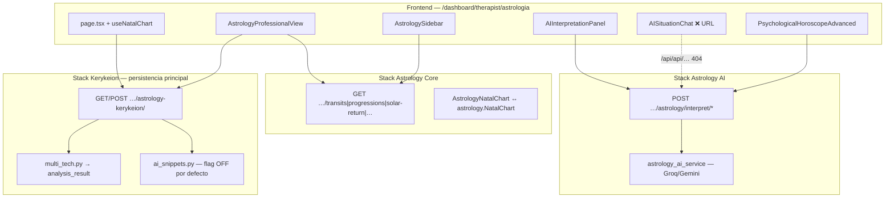

# Plan — Módulo Astrología Terapeuta Workable

**URL prod:** https://studios33.app/dashboard/therapist/astrologia  
**Ruta canónica:** `tonyblanco-app/app/(dashboard)/dashboard/therapist/(swm)/astrologia/page.tsx`  
**Fecha auditoría:** 2026-06-10 · **HEAD repo:** `4e8a21c5`  
**Relacionado:** Plan Maestro (workstream B dashboards + D5 smoke), `ASTROLOGIA_FASE3_AUDIT_2026-06-08.md`

---

## Resumen ejecutivo

El módulo **no está roto de arquitectura** — tiene backend amplio (14+ técnicas), frontend masivo (~4.400 LOC solo en `AstrologyProfessionalView` + `AstrologySidebar`) y AI interpretativa operativa en prod (`GET /api/astrology/ai-status/` → Groq habilitado). Lo que impide que sea **workable** en sesión terapéutica real es una mezcla de:

1. **Bloqueadores de wiring** (URLs rotas, IA con datos falsos, paneles muertos).
2. **Dependencia de datos** (consultante activo + carta natal + `analysis_result` multitech).
3. **Deuda de UI** (~300 líneas de código funcional sin botón que lo active).
4. **Cero tests de integración API** — solo e2e de house-system y scripts manuales.

| Dimensión | Veredicto |
|-----------|-----------|
| Gate de entrada (consultante + datos nacimiento) | ✅ Funciona |
| Cálculo carta natal (kerykeion/Swiss Ephemeris) | 🟡 Código OK; requiere datos + smoke autenticado |
| Capas profesionales (tránsitos/progresiones/retorno) | 🟡 Depende de `ASTRO_MULTITECH_ENABLED` + POST inicial |
| Sidebar técnicas avanzadas (API) | 🟡 Cableado; sin verificación E2E |
| IA interpretación natal/psicológica | 🟡 Backend live; capas secundarias degradadas |
| IA chat situacional | 🔴 **URL doble `/api`** → 404 en prod |
| Paneles comparativos / PDF / on-demand | 🔴 Estados `show*` nunca se activan |
| Comparación retorno solar A/B | 🔴 Forzada a `null` en `useEffect` |
| Tests / observabilidad | 🔴 API ~0% cobertura; D5 smoke pendiente |

**Meta del plan:** llevar el módulo de *"demo con muchos toggles"* a *"sesión terapéutica de 30 min sin callejones sin salida"* en **4 fases** (~2–3 PRs por fase).

---

## Smoke en producción (sin sesión terapeuta)

| Check | Resultado |
|-------|-----------|
| `GET https://studios33.app/dashboard/therapist/astrologia` | Muestra *"Consultante no seleccionado"* + *"Datos de nacimiento incompletos"* — gate correcto |
| `GET https://api.studios33.app/api/astrology/ai-status/` | `200` — `{"enabled":true,"model":"llama-3.3-70b-versatile"}` |
| `GET https://api.studios33.app/api/api/astrology/ai-status/` | `404` — confirma bug doble prefijo en `AISituationChat` |

**Implicación:** sin consultante activo en contexto profesional, **ninguna** funcionalidad del workspace es evaluable en prod. El smoke D5 autenticado es bloqueante para cerrar este módulo.

---

## Arquitectura (3 stacks paralelos)



**Tabla de persistencia dual (riesgo operativo):**

| Escritura | Tabla | Consumidor principal |
|-----------|-------|-------------------|
| Kerykeion POST | `api.models_astrology.AstrologyNatalChart` | `useNatalChart`, AI interpret |
| NatalChartView POST/PUT | `astrology.models.NatalChart` | Core engines (fallback read) |

---

## Inventario por superficie de UI

### A. Gate y contexto consultante

| Elemento | Estado | Evidencia | Para ser workable |
|----------|--------|-----------|-------------------|
| Consultante activo requerido | ✅ | `page.tsx:32-80` | Flujo normal del cockpit terapeuta |
| Diagnóstico campos faltantes | ✅ | `getMissingCanonicalFields` + labels ES | Commit `4e8a21c5` |
| Link "Completar perfil" | ✅ | `page.tsx:71-76` | — |
| Recalcular carta (modal) | 🟡 | Opciones P/K/W + tropical/sidereal; sidebar tiene E/R/dracónico | Unificar opciones modal ↔ sidebar |

### B. Tab Visual — Capas profesionales

| Capa | Estado | API | Bloqueo |
|------|--------|-----|---------|
| Carta natal | ✅ / NEEDS_DATA | `astrology-kerykeion` | Requiere POST inicial |
| Tránsitos (toggle) | NEEDS_DATA | `analysis_result.transits` en POST kerykeion | Deshabilitado si backend no devuelve capa (`:1303-1304`) |
| Progresiones | NEEDS_DATA | `analysis_result.progressions` | Igual |
| Retorno solar | NEEDS_DATA | `analysis_result.solarReturn` | Igual |
| Arco solar | UNTESTED | `GET …/solar-arc/?target_date=` | On-demand al activar capa |
| Retorno lunar | UNTESTED | `GET …/lunar-return/?target_month=` | On-demand |
| Doble rueda (overlays) | NEEDS_DATA | Desde `analysis_result` | Sin capas → sin doble rueda |
| Posiciones / aspectos / casas | ✅ / NEEDS_DATA | Payload carta | Empty states OK |
| Orbe slider | ✅ | Local | — |
| Toggles planeta/aspecto visibles | STUB | Estado existe; UI muestra solo contadores | Implementar controles o quitar copy engañoso |

### C. Sidebar izquierdo — Modos visuales vs API

| Control | Tipo | Estado | Notas |
|---------|------|--------|-------|
| Estilo Huber | Visual | ✅ | No recalcula |
| Carta natal | Visual | ✅ | — |
| Natal + Asteroides | STUB | `astrologyMethods.ts` dice active; solo checkbox genérico | Alinear registry |
| Sinastría / doble rueda | Parcial | ✅ UI | Partner necesita carta calculada |
| Compuesta / Davison | UNTESTED | `POST composite-chart`, `davison-chart` | Panel flotante esquina; no en rueda principal |
| Retorno solar (año) | DISABLED en modo real | Sidebar `mode="real"` deshabilita input año (`:526`) | Solo slider simbólico |
| Armónicos / Persona / Relocación | Visual simbólico | ✅ | No astronómicos — copy debe decirlo |
| Técnicas avanzadas (API) | UNTESTED | `transits`, `progressions`, `solar-return`, `harmonics`, `fixed-stars`, `arabic-parts` | Respuesta distinta a multitech |
| Footer "Próximas fases…" | MISLEADING | `AstrologySidebar.tsx:~919` | Contradice APIs ya existentes |

### D. Tab Psicológico

| Elemento | Estado | API | Notas |
|----------|--------|-----|-------|
| `PsychologicalHoroscopeAdvanced` | ✅ local | `psychEngine.ts` determinista | Tab activo |
| `PsychologicalAnalysisPanel` | UNUSED | — | Componente huérfano; eliminar o cablear |
| "Interpretar Todo" AI | UNTESTED | `POST …/interpret/psychological/` | Groq live en prod |
| Sparkles por sección | UNTESTED | Mismo endpoint | — |

### E. Paneles IA

| Panel | Estado | Endpoint | Bloqueo |
|-------|--------|----------|---------|
| AI status | ✅ | `/api/astrology/ai-status/` | Público (sin auth) |
| Interpretación natal | UNTESTED | `interpret/natal/` | Requiere carta persistida |
| Tránsitos / progresiones / retorno | DISABLED + DEGRADED | `interpret/*` | FE deshabilita sin capas; BE usa **natal como fallback** (`astrology_ai_views.py:197-198, 269-270`) |
| Historial | STUB | `GET interpretations/` | `TODO` modal — solo `console.log` |
| Compartir | STUB | `PUT interpretations/{id}/` | Sin toast éxito/error |
| **Chat situacional** | **🔴 BROKEN** | Debería ser `/api/astrology/interpret/situation/` | `AISituationChat` llama `/api/api/astrology/…` → **404** |

**Bug confirmado en prod:**

```ts
// AIInterpretationPanel.tsx — CORRECTO
fetch(`${getApiBaseUrl()}/astrology/ai-status/`)  // → …/api/astrology/ai-status/

// AISituationChat.tsx — INCORRECTO
fetch(`${getApiBaseUrl()}/api/astrology/ai-status/`)  // → …/api/api/astrology/ai-status/ → 404
```

### F. Código muerto en `AstrologyProfessionalView` (~300 LOC)

Estados inicializados en `false` **sin ningún setter a `true`** salvo botones "Cerrar":

| Estado | Línea init | Contenido bloqueado |
|--------|------------|---------------------|
| `showSecondaryProgressions` | 130 | Panel progresiones on-demand |
| `showSolarReturn` | 140 | Panel retorno solar on-demand |
| `showAdvancedTransits` | 122 | Panel tránsitos avanzados |
| `showCompareSolarReturn` | 137 | Comparativa natal↔SR + **Exportar PDF** |
| `showCompareProgressions` | 138 | Comparativa natal↔prog + PDF |
| Sinastría composite/davison | 1772 | `{false && (` — bloque entero |

`exportComparativeAsPDF` **sí está implementado** (`:683-697`, html2canvas + jspdf) pero solo accesible desde paneles inalcanzables.

### G. Comparación retorno solar A/B

| Item | Estado | Evidencia |
|------|--------|-----------|
| UI slider años A/B | Parcial | Render condicional en timeline |
| Datos comparación | 🔴 BROKEN | `useEffect` `:758-765` fuerza `setSolarReturnCompareYearB(null)` con comentario obsoleto |
| Backend `solar-return?year=` | ✅ Existe | Comentario FE desactualizado |

---

## Backend — endpoints y gaps

### Endpoints consumidos por el módulo

| Endpoint | Método | Consumidor FE | Estado |
|----------|--------|---------------|--------|
| `/api/therapist/patients/{id}/astrology-kerykeion/` | GET, POST | `useNatalChart`, recalc | Live |
| `/api/therapist/patients/{id}/solar-arc/` | GET | Capa arco solar | Wired |
| `/api/therapist/patients/{id}/lunar-return/` | GET | Capa retorno lunar | Wired |
| `/api/therapist/patients/{id}/composite-chart/` | POST | Sidebar compuesta | Wired |
| `/api/therapist/patients/{id}/davison-chart/` | POST | Sidebar davison | Wired |
| `/api/therapist/patients/{id}/transits/` etc. | GET | Sidebar técnicas avanzadas | Wired |
| `/api/astrology/ai-status/` | GET | Paneles IA | Live (público) |
| `/api/astrology/interpret/{natal,transits,progressions,solar-return,situation,psychological}/` | POST | Paneles IA | Live; capas 2-4 degradadas |
| `/api/astrology/interpretations/` | GET, PUT | Historial / compartir | Live; UI incompleta |

### Feature flags (prod)

| Variable | Default código | Prod esperado | Efecto |
|----------|----------------|---------------|--------|
| `ASTRO_MULTITECH_ENABLED` | `True` | Confirmar en `/opt/studio33/.env` | `analysis_result` en kerykeion |
| `KERYKEION_AI_SNIPPETS_ENABLED` | `False` | `True` vía `patch-astrology-ai-env.sh` | Snippets cabalísticos 3 líneas |
| `GROQ_API_KEY` | — | Presente (VoxTV copy) | AI interpret + snippets vía `llm_bridge` |

### Gaps backend críticos

| # | Gap | Severidad | Archivo |
|---|-----|-----------|---------|
| B1 | AI interpret transits/progressions/SR usa `chart_payload` natal como fallback | P0 | `astrology_ai_views.py:197-198, 269-270, 340-341` |
| B2 | `context-summary` — llamadas engine con firma incorrecta | P1 | `astrology/api/context_summary_view.py` |
| B3 | `AstrologyContextBuilder` URL errónea (`/astrology/context-summary/`) | P1 | `api/services/astrology_context_builder.py` |
| B4 | Persistencia dual sin contrato único | P1 | Kerykeion vs `astrology.NatalChart` |
| B5 | `DELETE` en `LunarReturnView` borra carta natal | P2 | `astrology/api/views.py` |
| B6 | Sin tests API kerykeion / AI | P0 observabilidad | — |
| B7 | `ai-status` público sin auth | P2 seguridad | `astrology_ai_views.py` |

---

## Cobertura de tests actual

| Área | Tests | Estado |
|------|-------|--------|
| Motor Swiss Ephemeris determinismo | `test_astrology_engine_determinism.py` | Unit (necesita `SWISSEPH_PATH`) |
| Multi-tech payload shape | `test_astrology_multitech_payload.py` | Mocked |
| Solar arc / lunar / composite engines | `astrology/tests/test_*.py` | Unit parcial |
| **API kerykeion GET/POST** | — | **Ninguno** |
| **API AI interpret** | — | **Ninguno** |
| **E2E Playwright** | `astrology-house-system.spec.ts` | Solo POST house system |
| Smoke offline | `scripts/astro_smoke_test.py` | No llama endpoints |

---

## Plan de implementación — 4 fases

### Fase 0 — Smoke autenticado (bloqueante Plan Maestro D5)

**Objetivo:** baseline reproducible con consultante real en prod.

| # | Tarea | Owner | DoD |
|---|-------|-------|-----|
| 0.1 | Ejecutar `bash deploy/studios33/scripts/smoke-d5-auth.sh` con credenciales terapeuta | DevOps | Log PASS/FAIL por ruta |
| 0.2 | Añadir paso smoke: `POST astrology-kerykeion` → assert `analysis_result.transits` presente | Backend | Script o Playwright autenticado |
| 0.3 | Confirmar en prod: `ASTRO_MULTITECH_ENABLED=True`, `KERYKEION_AI_SNIPPETS_ENABLED=True` | DevOps | `docker exec` env grep |
| 0.4 | Documentar consultante de prueba con carta precalculada | QA | ID + campos en runbook |

**Salida:** checklist firmada en `docs/RUNBOOK_ASTRO_PROD.md`.

---

### Fase 1 — P0 Bloqueadores (1 PR: `fix/astrologia-p0-wiring`)

**Objetivo:** lo que hoy falla con datos válidos.

| # | Fix | Archivos | Esfuerzo |
|---|-----|----------|----------|
| 1.1 | Corregir URLs `AISituationChat` — quitar `/api` duplicado | `AISituationChat.tsx:105,156` | 15 min |
| 1.2 | Habilitar comparación SR A/B — eliminar `setSolarReturnCompareYearB(null)` forzado; cablear slider a `GET solar-return?year=` | `AstrologyProfessionalView.tsx:758-765`, sidebar | 2–4 h |
| 1.3 | Conectar o eliminar paneles `show*` — **opción A (recomendada):** botones en sidebar "Técnicas on-demand" que setean `showAdvancedTransits` etc. **opción B:** borrar código muerto | `AstrologyProfessionalView.tsx`, `AstrologySidebar.tsx` | 4–8 h |
| 1.4 | Desbloquear sinastría composite/davison — cambiar `{false && (` por condición real | `AstrologyProfessionalView.tsx:1772` | 1 h |
| 1.5 | Wire AI interpret a datos reales — leer `analysis_result` o llamar `TransitsView` antes de `interpret_transits` | `astrology_ai_views.py` | 4–6 h |

**DoD Fase 1:**
- Chat situacional responde en prod con consultante + carta.
- Al menos un panel comparativo + PDF export accesible desde UI.
- `POST interpret/transits` recibe payload distinto de natal (test unitario).

---

### Fase 2 — P1 Integridad datos y UX honesta (1–2 PRs)

| # | Tarea | Detalle |
|---|-------|---------|
| 2.1 | Unificar opciones recalc (E, R, dracónico) entre modal y sidebar | Evitar "cambié Koch pero recalculó Placidus" |
| 2.2 | Alinear `lib/astrologyMethods.ts` con sidebar (Huber locked vs enabled, Davison coming_soon vs checkbox) | Fuente única de verdad |
| 2.3 | Historial interpretaciones — modal con `GET interpretations/?patient_id=` | Cerrar TODO `AIInterpretationPanel.tsx:321` |
| 2.4 | Toasts compartir / error PDF | `AIInterpretationPanel`, `exportComparativeAsPDF` |
| 2.5 | Actualizar copy sidebar footer y badges "pendiente" en `CalculationStatusPanel` | Reflejar estado real post-Fase 1 |
| 2.6 | Fix `context-summary` + `AstrologyContextBuilder` URL | Para federation/holistic futuro |
| 2.7 | Eliminar o integrar `PsychologicalAnalysisPanel` | Reducir confusión mantenedores |

**DoD Fase 2:** terapeuta completa flujo Visual → IA natal → IA tránsitos (con capa activa) → historial, sin mensajes contradictorios.

---

### Fase 3 — P2 Tests y hardening (1 PR)

| # | Tarea |
|---|-------|
| 3.1 | `test_kerykeion_multitech_contract.py` — POST con paciente fixture → assert keys `transits`, `progressions`, `solarReturn` |
| 3.2 | `test_astrology_ai_interpret_natal.py` — mock Groq → 200 + shape |
| 3.3 | Playwright: flujo consultante → calcular → toggle tránsitos → interpret natal |
| 3.4 | Auth en `ai-status` o rate-limit público |
| 3.5 | Unificar persistencia: kerykeion write → core read only; deprecar dual POST |

**DoD Fase 3:** CI verde con ≥3 tests API astrología; e2e en `playwright-e2e` workflow.

---

### Fase 4 — Fuera de alcance inmediato (backlog)

| Item | Referencia |
|------|------------|
| SCL-90 FE questionnaire | `TEST_CATALOG_WIRING.md` |
| Process Memory / PlanAI RAG | `planai.md` |
| Workspace combinado Astrología\|Tarot | `astrologia-tarot` — mantener separado |
| Relocation / synastry backend endpoints | FE usa overlays client-side |
| Rotar `GEMINI_API_KEY` en `backend/.env.gemini` versionado | Seguridad — tarea activa en session_context |

---

## Definition of Done — Módulo "Workable"

Un terapeuta autenticado puede, **sin soporte técnico**:

1. Seleccionar consultante con datos nacimiento completos.
2. Calcular o cargar carta natal en &lt; 30 s.
3. Activar al menos **tránsitos** o **progresiones** desde capas profesionales (datos reales, no placeholder).
4. Generar interpretación AI natal y una capa secundaria con **datos correctos**.
5. Usar chat situacional con al menos una pregunta sugerida.
6. Exportar comparativa PDF desde UI visible.
7. Ver historial de interpretaciones guardadas.
8. Pasar smoke D5 + e2e Playwright astrología en CI.

---

## Asignación sugerida (anti-colisión)

| Agente | Fases | Rama |
|--------|-------|------|
| Frontend | 1.1–1.4, 2.1–2.5 | `fix/astrologia-fe-workable` |
| Backend/Wiring | 1.5, 2.6, 3.1–3.2 | `fix/astrologia-be-ai-layers` |
| DevOps/QA | 0.x, 3.3, D5 | `chore/astrologia-smoke` |

---

## Actualización Plan Maestro (cuando se despliegue)

Tras merge + deploy de Fase 1:

- Reabrir o crear ítem bajo workstream **B** o anexo astrología: `- [ ] **B-ASTRO — Módulo astrología workable (⬅ Fase 1 `SHA`)**`
- Actualizar callout estado con fecha + SHA.
- Registrar en `.ai-memory/`: `[BUG]` chat URL, `[ENDPOINT]` AI layers, `[DECISION]` paneles show* wiring.

---

## Referencias

| Doc | Uso |
|-----|-----|
| `docs/01_PROJECT_STATE/ASTROLOGIA_FASE3_AUDIT_2026-06-08.md` | Fase 3 snippets/PDF/timeline (parcialmente aplicada) |
| `docs/01_PROJECT_STATE/AUDIT_ASTROLOGIA_TAROT_2026-06-08.md` | Workspace tarot separado |
| `docs/RUNBOOK_ASTRO_PROD.md` | Operación prod |
| `deploy/studios33/scripts/patch-astrology-ai-env.sh` | Activar snippets |
| `tonyblanco-app/components/AstrologyWorkspace/README.md` | Contrato workspace |

---

*Generado por auditoría código + smoke prod 2026-06-10. Próximo paso recomendado: Fase 0 (smoke D5) → Fase 1 PR único con fixes 1.1 + 1.3 + 1.5.*