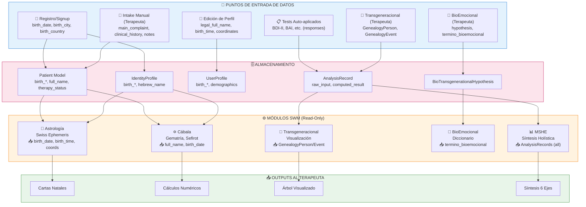
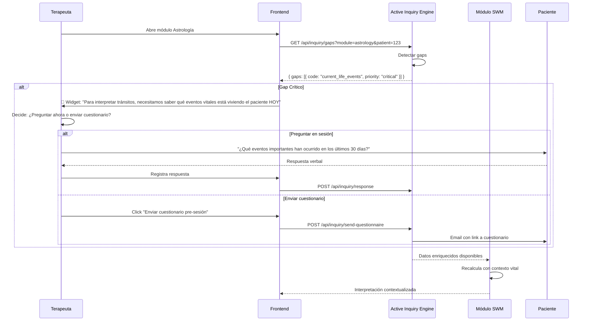

# 📊 Estrategia de Interacción Paciente-Módulo: Active Inquiry Engine

**Fecha de Creación:** 2026-01-25  
**Autor:** Agente ARQ (Claude Opus 4.5)  
**Estado:** Propuesta para Aprobación de Gobernanza  
**Versión:** 1.0

---

## Resumen Ejecutivo

Los módulos SWM (Astrología, Cábala, Transgeneracional, BioEmocional) están técnicamente completos pero operan en modo "read-only" respecto al contexto vital del paciente. Calculan con datos estáticos (fecha/nombre) sin conocer la experiencia actual del consultante.

**Problema Core:** "La única manera de conocer al consultante es haciendo preguntas."

**Solución Propuesta:** "Active Inquiry Engine" (AIE) — sistema que detecta gaps de conocimiento y solicita información contextual de forma no intrusiva.

### Hallazgos Clave

| Hallazgo | Impacto |
|----------|---------|
| 5 gaps críticos identificados | Módulos operan con ~40% de contexto necesario |
| 0 mecanismos de feedback actuales | No hay validación de interpretaciones |
| Tests clínicos desconectados de SWM | SCID-5, BDI-II no informan a Astrología/Cábala |
| Datos temporales inexistentes | Ningún módulo sabe qué pasa HOY en vida del paciente |

### Prioridades Identificadas

1. 🔴 **CRÍTICO**: Eventos vitales actuales para Astrología
2. 🔴 **CRÍTICO**: Síntomas físicos actuales para BioEmocional
3. 🔴 **CRÍTICO**: Carga emocional por ancestro para Transgeneracional
4. 🟡 **IMPORTANTE**: Satisfacción con propósito para Cábala
5. 🟡 **IMPORTANTE**: Validación de hipótesis bidireccional

---

## 1. INTERACTION HEATMAP — Flujo de Datos Actual



### Brechas Críticas en el Flujo

| Punto | Problema |
|-------|----------|
| **ASTRO ← PATIENT** | Solo recibe datos estáticos. No sabe qué eventos vitales vive HOY el paciente. |
| **CABALA ← PATIENT** | Calcula "Sendero de Vida" pero desconoce satisfacción con propósito actual. |
| **TRANSGMOD ← HYPOTHESIS** | Mapea ancestros pero no tiene carga emocional real asociada. |
| **BIOMOD ← HYPOTHESIS** | Diccionario simbólico, pero sin contexto de síntomas físicos actuales. |
| **MSHE ← ANALYSIS** | Agrega todo pero no puede diferenciar contexto temporal (pasado vs presente). |

---

## 2. KNOWLEDGE GAPS ANALYSIS — Matriz de Brechas

### 2.1 Tabla Detallada por Módulo

| Módulo | Dato Estático Actual | Info Vital Faltante | Prioridad | Fuente Potencial |
|--------|---------------------|---------------------|-----------|------------------|
| **Astrología** | birth_date, birth_time, coords | Eventos vitales HOY (cambio trabajo, mudanza, duelo, relación) | 🔴 ALTA | Intake contextual / Session notes |
| **Astrología** | Tránsitos calculados | ¿Qué tránsito está SINTIENDO el paciente? | 🟡 MEDIA | Pregunta directa |
| **Cábala (Sendero)** | birth_date → Life Path number | ¿Está satisfecho con su propósito actual? (1-10) | 🔴 ALTA | Escala simple |
| **Cábala (Nombre)** | full_name → Gematría | ¿Hay conflicto con el nombre? ¿Cambio legal? | 🟡 MEDIA | Pregunta directa |
| **Transgeneracional** | GenealogyPerson (nombre, relación) | Carga emocional por figura (1-10 + texto) | 🔴 ALTA | Formulario por ancestro |
| **Transgeneracional** | GenealogyEvent (tipo, fecha) | Impacto percibido del evento en vida actual | 🟡 MEDIA | Escala + reflexión |
| **BioEmocional** | termino_bioemocional (diccionario) | Síntomas físicos actuales del paciente | 🔴 ALTA | Checklist somático |
| **BioEmocional** | hypothesis (texto terapeuta) | Validación del paciente ("¿resuena?") | 🟡 MEDIA | Feedback loop |
| **MSHE** | Scores simbólicos (6 ejes) | Eventos vitales temporales (últimos 30 días) | 🔴 ALTA | Timeline vital |
| **MSHE** | Snapshot de lecturas | Autoevaluación del paciente de cada eje | 🟡 MEDIA | Mini-cuestionario 6 preguntas |

### 2.2 Resumen de Prioridades

```
🔴 GAPS CRÍTICOS (5):
   1. Astrología: Eventos vitales actuales
   2. Cábala: Satisfacción con propósito
   3. Transgeneracional: Carga emocional por ancestro
   4. BioEmocional: Síntomas físicos actuales
   5. MSHE: Timeline vital reciente

🟡 GAPS IMPORTANTES (5):
   1. Astrología: Resonancia de tránsitos
   2. Cábala: Conflicto con nombre
   3. Transgeneracional: Impacto de eventos
   4. BioEmocional: Validación de hipótesis
   5. MSHE: Autoevaluación de ejes
```

---

## 3. ACTIVE INQUIRY ENGINE BLUEPRINT

### 3.1 Arquitectura Conceptual

```
┌─────────────────────────────────────────────────────────────────────┐
│                    ACTIVE INQUIRY ENGINE (AIE)                       │
├─────────────────────────────────────────────────────────────────────┤
│                                                                      │
│  ┌──────────────┐    ┌──────────────┐    ┌──────────────┐          │
│  │  Knowledge   │───▶│   Inquiry    │───▶│  Response    │          │
│  │  Gap Detector│    │  Generator   │    │  Integrator  │          │
│  └──────────────┘    └──────────────┘    └──────────────┘          │
│         │                   │                   │                   │
│         ▼                   ▼                   ▼                   │
│  ┌──────────────────────────────────────────────────────────┐      │
│  │                    INQUIRY QUEUE                          │      │
│  │  [priority: critical | important | optional]             │      │
│  │  [trigger: on_session_start | on_demand | auto]         │      │
│  │  [source_module: astrology | cabala | trans | bio]      │      │
│  └──────────────────────────────────────────────────────────┘      │
│                              │                                      │
│                              ▼                                      │
│  ┌──────────────────────────────────────────────────────────┐      │
│  │                 DELIVERY CHANNELS                         │      │
│  │  • In-Session Widget (terapeuta administra)              │      │
│  │  • Pre-Session Questionnaire (paciente completa antes)   │      │
│  │  • Module-Embedded Prompts (inline en cada módulo)       │      │
│  └──────────────────────────────────────────────────────────┘      │
│                                                                      │
└─────────────────────────────────────────────────────────────────────┘
```

### 3.2 Modelo de Datos Propuesto

```python
# backend/api/inquiry/models.py (PROPUESTA)

class InquiryDefinition(models.Model):
    """Define una pregunta que un módulo puede necesitar"""
    code = models.CharField(max_length=50, unique=True)
    question_text = models.TextField()
    question_text_short = models.CharField(max_length=200)  # Para widgets compactos
    question_type = models.CharField(max_length=20, choices=[
        ('scale_1_10', 'Escala 1-10'),
        ('yes_no', 'Sí/No'),
        ('text_short', 'Texto corto (< 200 chars)'),
        ('text_long', 'Texto largo'),
        ('choice_single', 'Selección única'),
        ('choice_multi', 'Selección múltiple'),
        ('date', 'Fecha'),
        ('date_range', 'Rango de fechas'),
    ])
    choices = models.JSONField(null=True, blank=True)  # Para choice_single/multi
    
    source_module = models.CharField(max_length=50)  # astrology, cabala, trans, bio, mshe
    priority = models.CharField(max_length=20, choices=[
        ('critical', 'Crítica - Sin esto el módulo funciona limitado'),
        ('important', 'Importante - Mejora significativa'),
        ('optional', 'Opcional - Enriquecimiento'),
    ])
    
    # Condiciones de activación
    trigger_condition = models.JSONField(default=dict)
    
    # Metadata
    category = models.CharField(max_length=50, blank=True)
    help_text = models.TextField(blank=True)
    is_active = models.BooleanField(default=True)
    created_at = models.DateTimeField(auto_now_add=True)
    
    class Meta:
        ordering = ['source_module', 'priority', 'code']


class PatientInquiryResponse(models.Model):
    """Respuesta del paciente a una inquiry"""
    patient = models.ForeignKey('Patient', on_delete=models.CASCADE, related_name='inquiry_responses')
    inquiry = models.ForeignKey(InquiryDefinition, on_delete=models.CASCADE)
    
    response_value = models.JSONField()
    
    collected_at = models.DateTimeField(auto_now_add=True)
    collected_by = models.CharField(max_length=20, choices=[
        ('patient_self', 'Auto-completado por paciente'),
        ('therapist_session', 'Recolectado en sesión por terapeuta'),
        ('intake_form', 'Formulario de intake'),
        ('pre_session', 'Cuestionario pre-sesión'),
    ])
    
    session = models.ForeignKey('Session', null=True, blank=True, on_delete=models.SET_NULL)
    notes = models.TextField(blank=True)
    
    valid_until = models.DateField(null=True, blank=True)
    is_current = models.BooleanField(default=True)
    
    class Meta:
        ordering = ['-collected_at']
        indexes = [
            models.Index(fields=['patient', 'inquiry', '-collected_at']),
        ]


class InquiryBatch(models.Model):
    """Agrupa inquiries para envío como cuestionario"""
    patient = models.ForeignKey('Patient', on_delete=models.CASCADE)
    therapist = models.ForeignKey('User', on_delete=models.CASCADE)
    
    inquiries = models.ManyToManyField(InquiryDefinition)
    
    sent_at = models.DateTimeField(null=True, blank=True)
    completed_at = models.DateTimeField(null=True, blank=True)
    expires_at = models.DateTimeField(null=True, blank=True)
    
    access_token = models.UUIDField(default=uuid.uuid4, unique=True)
    
    status = models.CharField(max_length=20, choices=[
        ('draft', 'Borrador'),
        ('sent', 'Enviado'),
        ('partial', 'Parcialmente completado'),
        ('completed', 'Completado'),
        ('expired', 'Expirado'),
    ], default='draft')
```

### 3.3 API Endpoints Propuestos

```python
# backend/api/inquiry/urls.py

urlpatterns = [
    # Gap Detection
    path('gaps/', InquiryGapsView.as_view()),
    # GET /api/inquiry/gaps/?patient=123&module=astrology
    
    # Inquiry Definitions
    path('definitions/', InquiryDefinitionListView.as_view()),
    # GET /api/inquiry/definitions/?module=astrology&priority=critical
    
    # Responses
    path('responses/', PatientInquiryResponseView.as_view()),
    # POST /api/inquiry/responses/
    
    path('responses/<int:patient_id>/', PatientInquiryHistoryView.as_view()),
    # GET /api/inquiry/responses/123/?module=astrology
    
    # Batches (Cuestionarios)
    path('batches/', InquiryBatchListCreateView.as_view()),
    # POST /api/inquiry/batches/
    
    path('batches/<uuid:token>/', InquiryBatchPublicView.as_view()),
    # GET /api/inquiry/batches/<token>/  (público para paciente)
]
```

### 3.4 Flujo de Activación de Preguntas



### 3.5 Integración con Tests Clínicos Existentes

| Test Existente | Información que Aporta | Módulos Beneficiados | Trigger Automático |
|----------------|----------------------|---------------------|-------------------|
| **SCID-5** | MDE, GAD, PTSD diagnosis | MSHE, BioEmocional | Si PTSD → trigger `trauma_event_exploration` |
| **BDI-II** | Severidad depresiva (0-63) | MSHE, Astrología | Si score > 20 → trigger `mood_context` |
| **BAI** | Severidad ansiedad (0-63) | MSHE, BioEmocional | Si score > 15 → trigger `anxiety_physical_manifestation` |
| **PCL-5** | Indicadores trauma (0-80) | Transgeneracional, BioEmocional | Si score > 33 → trigger `trauma_timeline` |
| **EAT-26** | Conducta alimentaria | BioEmocional, Cábala | Si score > 20 → trigger `body_relationship` |

---

## 4. IMPLEMENTATION ROADMAP

### Fase MVP: Foundation (4-6 semanas)

| Semana | Componente | Entregables | Criterio de Éxito |
|--------|------------|-------------|-------------------|
| 1-2 | **Modelos Backend** | `InquiryDefinition`, `PatientInquiryResponse` | Migraciones aplicadas, admin funcional |
| 1-2 | **Seeding Inicial** | 20-30 InquiryDefinitions | Cobertura de gaps críticos de los 4 módulos |
| 3-4 | **Gap Detector** | `KnowledgeGapDetector` class | Tests unitarios pasando |
| 3-4 | **API Endpoints** | `/inquiry/gaps/`, `/inquiry/responses/` | Swagger docs, integration tests |
| 5-6 | **Widget React** | `<InquiryWidget>` component | Integrado en Astrología (piloto) |
| 5-6 | **Modal de Respuesta** | UI para capturar respuestas inline | UX review aprobado |

**Entregable MVP:** Widget funcional en módulo Astrología que detecta y permite capturar eventos vitales actuales.

---

### Fase 1: Cuestionarios Pre-Sesión (6-8 semanas)

| Semana | Componente | Entregables |
|--------|------------|-------------|
| 7-8 | **InquiryBatch Model** | Agrupación de preguntas, tokens únicos |
| 9-10 | **Portal Paciente** | Página pública para completar cuestionarios |
| 11-12 | **Sistema de Envío** | Email templates, links seguros |
| 13-14 | **Dashboard Terapeuta** | Vista "Datos pendientes por paciente" |

**Entregable Fase 1:** Terapeuta puede enviar cuestionario contextual antes de sesión.

---

### Fase 2: Feedback Loops Bidireccionales (8-10 semanas)

| Semana | Componente | Entregables |
|--------|------------|-------------|
| 15-18 | **Validación de Outputs** | "¿Resuena esta interpretación?" widget |
| 19-22 | **Loop BioEmocional** | Hipótesis → Validación → Ajuste |
| 23-24 | **Refinamiento Progresivo** | Sistema de aprendizaje de resonancias |

**Entregable Fase 2:** Las interpretaciones simbólicas incluyen validación del paciente.

---

### Fase 3: Integración con Tests Clínicos (6-8 semanas)

| Semana | Componente | Entregables |
|--------|------------|-------------|
| 25-28 | **Cross-Reference Engine** | Triggers automáticos desde tests |
| 29-32 | **Dashboard Integrado** | Vista unificada gaps + tests + inquiries |

**Entregable Fase 3:** Los resultados de tests clínicos informan automáticamente qué preguntar.

---

### Fase 4: IA Socrática (12-16 semanas)

| Semana | Componente | Entregables |
|--------|------------|-------------|
| 33-40 | **Generador de Preguntas IA** | Preguntas contextuales basadas en gaps |
| 41-48 | **Diario Simbólico** | Prompts guiados para reflexión del paciente |

**Entregable Fase 4:** Sistema de indagación adaptativo con IA mayéutica.

---

## 5. DEFINICIONES DE INQUIRY COMPLETAS (MVP Ready)

### 5.1 Módulo: Astrología (6 inquiries)

#### ASTRO-001: Eventos Vitales Actuales [CRÍTICA]

```json
{
  "code": "astro_current_life_events",
  "source_module": "astrology",
  "priority": "critical",
  "category": "contexto_temporal",
  "question_type": "text_long",
  "question_text": "¿Qué eventos significativos han ocurrido en tu vida en los últimos 30 días? Por favor, incluye cambios importantes como: mudanzas, cambios de trabajo, inicios o finales de relaciones, pérdidas, logros, decisiones importantes, etc.",
  "question_text_short": "Eventos vitales recientes (últimos 30 días)",
  "help_text": "Esta información nos ayuda a contextualizar los tránsitos planetarios actuales con tu experiencia real. No hay eventos 'demasiado pequeños' - si fue significativo para ti, es importante.",
  "placeholder": "Ej: 'Comencé un nuevo trabajo hace 2 semanas, mi padre se enfermó gravemente, decidí mudarme...'",
  "validation": {
    "min_length": 20,
    "max_length": 1000
  },
  "trigger_condition": {
    "on_module_open": true,
    "refresh_after_days": 30
  },
  "valid_for_days": 30,
  "collected_by_default": "therapist_session"
}
```

#### ASTRO-002: Resonancia de Tránsitos [IMPORTANTE]

```json
{
  "code": "astro_transit_resonance",
  "source_module": "astrology",
  "priority": "important",
  "category": "experiencia_subjetiva",
  "question_type": "choice_multi",
  "question_text": "Al revisar los tránsitos astrológicos actuales, ¿cuáles de estos temas sientes especialmente presentes en tu vida en este momento? (Puedes seleccionar varios)",
  "question_text_short": "Temas vitales actuales",
  "help_text": "Los tránsitos planetarios pueden manifestarse de múltiples formas. Esto nos ayuda a identificar qué áreas de tu vida están más activas.",
  "choices": [
    {
      "value": "identity_direction",
      "label": "Cambios en identidad o dirección de vida",
      "related_planets": ["Sol", "Plutón", "Urano"]
    },
    {
      "value": "emotional_family",
      "label": "Temas emocionales o familiares profundos",
      "related_planets": ["Luna", "Cáncer", "Casa 4"]
    },
    {
      "value": "communication_learning",
      "label": "Comunicación, aprendizaje, ideas nuevas",
      "related_planets": ["Mercurio", "Géminis"]
    },
    {
      "value": "relationships_values",
      "label": "Relaciones, amor, valores personales",
      "related_planets": ["Venus", "Libra"]
    },
    {
      "value": "action_energy",
      "label": "Acción, energía, conflictos o asertividad",
      "related_planets": ["Marte", "Aries"]
    },
    {
      "value": "expansion_growth",
      "label": "Expansión, crecimiento, viajes, educación",
      "related_planets": ["Júpiter", "Sagitario"]
    },
    {
      "value": "restrictions_responsibility",
      "label": "Restricciones, responsabilidades, estructuras",
      "related_planets": ["Saturno", "Capricornio"]
    },
    {
      "value": "unexpected_changes",
      "label": "Cambios inesperados, liberación, rebeldía",
      "related_planets": ["Urano", "Acuario"]
    },
    {
      "value": "spirituality_intuition",
      "label": "Espiritualidad, intuición, confusión o inspiración",
      "related_planets": ["Neptuno", "Piscis"]
    },
    {
      "value": "transformation_power",
      "label": "Transformación profunda, poder, intensidad",
      "related_planets": ["Plutón", "Escorpio"]
    },
    {
      "value": "none",
      "label": "Ninguno de estos temas resuena especialmente"
    }
  ],
  "trigger_condition": {
    "analysis_exists": "astrology",
    "field_calculated": "transits"
  },
  "valid_for_days": 60
}
```

#### ASTRO-003: Confianza en Hora de Nacimiento [IMPORTANTE]

```json
{
  "code": "astro_birth_time_confidence",
  "source_module": "astrology",
  "priority": "important",
  "category": "datos_basicos",
  "question_type": "choice_single",
  "question_text": "¿Qué tan seguro/a estás de tu hora exacta de nacimiento?",
  "question_text_short": "Confianza en hora natal",
  "help_text": "La precisión de la hora de nacimiento afecta el cálculo del Ascendente y las Casas astrológicas. Esto nos ayuda a interpretar con el nivel de certeza apropiado.",
  "choices": [
    {
      "value": "certified",
      "label": "Muy seguro (tengo certificado de nacimiento o partida oficial)",
      "precision_level": "high"
    },
    {
      "value": "family_memory",
      "label": "Bastante seguro (familiar directo lo recuerda)",
      "precision_level": "medium-high"
    },
    {
      "value": "approximate",
      "label": "Aproximado (± 1-2 horas de margen)",
      "precision_level": "medium"
    },
    {
      "value": "unknown",
      "label": "No lo sé / No estoy seguro",
      "precision_level": "low"
    },
    {
      "value": "rectified",
      "label": "Hora rectificada por astrólogo profesional",
      "precision_level": "rectified"
    }
  ],
  "trigger_condition": {
    "missing_field": "birth_time_confidence"
  }
}
```

#### ASTRO-004: Áreas de Vida Activas [OPCIONAL]

```json
{
  "code": "astro_active_life_areas",
  "source_module": "astrology",
  "priority": "optional",
  "category": "casas_astrologicas",
  "question_type": "choice_multi",
  "question_text": "¿En qué áreas de tu vida sientes más actividad, cambios o desafíos actualmente?",
  "question_text_short": "Áreas de vida activas",
  "help_text": "Esto nos ayuda a correlacionar las casas astrológicas con tu experiencia real.",
  "choices": [
    {"value": "casa1", "label": "Identidad personal, apariencia, cómo me presento"},
    {"value": "casa2", "label": "Dinero, recursos propios, valores"},
    {"value": "casa3", "label": "Comunicación, hermanos, vecinos, estudios cortos"},
    {"value": "casa4", "label": "Hogar, familia, raíces, vida privada"},
    {"value": "casa5", "label": "Creatividad, romance, hijos, diversión"},
    {"value": "casa6", "label": "Trabajo diario, salud, rutinas, servicio"},
    {"value": "casa7", "label": "Relaciones de pareja, asociaciones, contratos"},
    {"value": "casa8", "label": "Transformación, sexualidad, recursos compartidos"},
    {"value": "casa9", "label": "Viajes largos, filosofía, educación superior"},
    {"value": "casa10", "label": "Carrera, reputación, vocación pública"},
    {"value": "casa11", "label": "Amistades, grupos, proyectos colectivos"},
    {"value": "casa12", "label": "Espiritualidad, inconsciente, retiro"}
  ],
  "valid_for_days": 90
}
```

#### ASTRO-005: Sincronicidades [OPCIONAL]

```json
{
  "code": "astro_synchronicities",
  "source_module": "astrology",
  "priority": "optional",
  "category": "experiencia_subjetiva",
  "question_type": "text_long",
  "question_text": "¿Has experimentado coincidencias significativas o sincronicidades recientemente?",
  "question_text_short": "Sincronicidades recientes",
  "help_text": "Las sincronicidades pueden indicar momentos de alta resonancia astrológica.",
  "placeholder": "Ej: 'Pensé en una persona y me llamó ese mismo día, números que se repiten, encuentros inesperados...'",
  "validation": {
    "max_length": 500
  },
  "valid_for_days": 30
}
```

#### ASTRO-006: Retorno Solar Próximo [CONTEXTUAL]

```json
{
  "code": "astro_solar_return_intentions",
  "source_module": "astrology",
  "priority": "important",
  "category": "contexto_temporal",
  "question_type": "text_long",
  "question_text": "Tu cumpleaños (retorno solar) está próximo. ¿Qué intenciones o deseos tienes para este nuevo ciclo anual?",
  "question_text_short": "Intenciones para el nuevo año solar",
  "help_text": "El retorno solar marca el inicio de un nuevo ciclo anual personal. Conocer tus intenciones nos ayuda a enfocar la interpretación.",
  "trigger_condition": {
    "days_to_birthday": {"min": -7, "max": 30}
  },
  "valid_for_days": 365
}
```

---

### 5.2 Módulo: Cábala (6 inquiries)

#### CABALA-001: Satisfacción con Propósito [CRÍTICA]

```json
{
  "code": "cabala_purpose_satisfaction",
  "source_module": "cabala",
  "priority": "critical",
  "category": "proposito_vida",
  "question_type": "scale_1_10",
  "question_text": "En una escala del 1 al 10, ¿qué tan alineado/a te sientes con tu propósito de vida actualmente?",
  "question_text_short": "Alineación con propósito (1-10)",
  "help_text": "1 = Completamente perdido/a, sin dirección. 10 = Totalmente alineado/a, viviendo mi propósito plenamente.",
  "scale_labels": {
    "1": "Completamente perdido/a",
    "5": "Parcialmente alineado/a",
    "10": "Totalmente alineado/a"
  },
  "trigger_condition": {
    "analysis_exists": "kabbalah",
    "calculation_includes": "life_path"
  },
  "valid_for_days": 90,
  "follow_up": {
    "if_score": {"max": 4},
    "then_ask": "cabala_purpose_obstacles"
  }
}
```

#### CABALA-002: Obstáculos al Propósito [IMPORTANTE]

```json
{
  "code": "cabala_purpose_obstacles",
  "source_module": "cabala",
  "priority": "important",
  "category": "proposito_vida",
  "question_type": "text_long",
  "question_text": "¿Qué sientes que te impide vivir más alineado/a con tu propósito?",
  "question_text_short": "Obstáculos al propósito",
  "help_text": "Pueden ser factores externos (trabajo, familia) o internos (miedo, creencias limitantes).",
  "trigger_condition": {
    "response_exists": "cabala_purpose_satisfaction",
    "response_value": {"max": 4}
  },
  "valid_for_days": 90
}
```

#### CABALA-003: Relación con el Nombre [IMPORTANTE]

```json
{
  "code": "cabala_name_relationship",
  "source_module": "cabala",
  "priority": "important",
  "category": "identidad_nombre",
  "question_type": "choice_single",
  "question_text": "¿Cómo te sientes con tu nombre completo actual?",
  "question_text_short": "Relación con el nombre",
  "help_text": "En Cábala, el nombre tiene un poder vibracional significativo. Tu relación con él es importante.",
  "choices": [
    {
      "value": "comfortable",
      "label": "Cómodo/a, me identifico plenamente con mi nombre"
    },
    {
      "value": "neutral",
      "label": "Neutral, no me genera sentimientos fuertes"
    },
    {
      "value": "occasional_discomfort",
      "label": "A veces me incomoda o no resuena completamente"
    },
    {
      "value": "strong_conflict",
      "label": "Tengo un conflicto importante con mi nombre"
    },
    {
      "value": "changed_it",
      "label": "Ya cambié mi nombre legalmente"
    },
    {
      "value": "planning_change",
      "label": "Estoy considerando o planeo cambiar mi nombre"
    }
  ],
  "trigger_condition": {
    "analysis_exists": "kabbalah",
    "calculation_includes": "name_gematria"
  },
  "follow_up": {
    "if_value": ["strong_conflict", "planning_change"],
    "then_ask": "cabala_name_conflict_detail"
  }
}
```

#### CABALA-004: Detalle Conflicto con Nombre [CONTEXTUAL]

```json
{
  "code": "cabala_name_conflict_detail",
  "source_module": "cabala",
  "priority": "important",
  "category": "identidad_nombre",
  "question_type": "text_long",
  "question_text": "¿Qué aspecto de tu nombre te genera conflicto o incomodidad?",
  "question_text_short": "Detalle del conflicto con nombre",
  "help_text": "Puede ser fonética, significado, asociaciones familiares, género, o simplemente 'no se siente como yo'.",
  "trigger_condition": {
    "response_exists": "cabala_name_relationship",
    "response_value": ["strong_conflict", "planning_change"]
  }
}
```

#### CABALA-005: Prácticas Espirituales [OPCIONAL]

```json
{
  "code": "cabala_spiritual_practices",
  "source_module": "cabala",
  "priority": "optional",
  "category": "practica_espiritual",
  "question_type": "choice_multi",
  "question_text": "¿Qué prácticas espirituales o de autoconocimiento realizas regularmente?",
  "question_text_short": "Prácticas espirituales",
  "help_text": "Esto nos ayuda a contextualizar las recomendaciones cabalísticas.",
  "choices": [
    {"value": "meditation", "label": "Meditación"},
    {"value": "prayer", "label": "Oración"},
    {"value": "yoga", "label": "Yoga"},
    {"value": "journaling", "label": "Escritura/Diario personal"},
    {"value": "tarot_oracle", "label": "Tarot u Oráculos"},
    {"value": "energy_work", "label": "Trabajo energético (Reiki, etc.)"},
    {"value": "breathwork", "label": "Trabajo de respiración"},
    {"value": "contemplation", "label": "Contemplación/Estudio espiritual"},
    {"value": "ritual", "label": "Rituales personales"},
    {"value": "none", "label": "No practico ninguna actualmente"}
  ],
  "valid_for_days": 180
}
```

#### CABALA-006: Ciclo de Vida Actual [IMPORTANTE]

```json
{
  "code": "cabala_life_cycle_experience",
  "source_module": "cabala",
  "priority": "important",
  "category": "ciclos_vida",
  "question_type": "text_long",
  "question_text": "¿Cómo describirías el momento vital en el que te encuentras actualmente?",
  "question_text_short": "Momento vital actual",
  "help_text": "Piensa en términos de fase de vida: ¿inicio, expansión, consolidación, transición, cierre?",
  "trigger_condition": {
    "analysis_exists": "kabbalah",
    "calculation_includes": "life_cycles"
  },
  "valid_for_days": 90
}
```

---

### 5.3 Módulo: Transgeneracional (6 inquiries)

#### TRANS-001: Carga Emocional por Ancestro [CRÍTICA]

```json
{
  "code": "trans_ancestor_emotional_charge",
  "source_module": "transgenerational",
  "priority": "critical",
  "category": "genealogia_emocional",
  "question_type": "scale_1_10",
  "question_text": "Para {ancestor_name} ({relationship}), indica la carga emocional que sientes hacia esta persona:",
  "question_text_short": "Carga emocional hacia {ancestor_name}",
  "help_text": "1 = Neutral, sin carga emocional particular. 10 = Muy cargado emocionalmente (puede ser positivo o negativo).",
  "scale_labels": {
    "1": "Neutral",
    "5": "Moderadamente cargado",
    "10": "Muy intenso"
  },
  "trigger_condition": {
    "genealogy_person_exists": true,
    "missing_field": "emotional_charge"
  },
  "dynamic": true,
  "applies_per": "GenealogyPerson",
  "follow_up": {
    "if_score": {"min": 7},
    "then_ask": "trans_ancestor_charge_detail"
  }
}
```

#### TRANS-002: Detalle Carga Emocional [CONTEXTUAL]

```json
{
  "code": "trans_ancestor_charge_detail",
  "source_module": "transgenerational",
  "priority": "important",
  "category": "genealogia_emocional",
  "question_type": "text_long",
  "question_text": "¿Puedes describir qué sentimientos o memorias están asociados a {ancestor_name}?",
  "question_text_short": "Detalle emocional {ancestor_name}",
  "help_text": "Pueden ser experiencias directas, historias que te contaron, o simplemente sensaciones que tienes.",
  "trigger_condition": {
    "response_exists": "trans_ancestor_emotional_charge",
    "response_value": {"min": 7}
  },
  "dynamic": true
}
```

#### TRANS-003: Secretos Familiares [IMPORTANTE]

```json
{
  "code": "trans_family_secrets",
  "source_module": "transgenerational",
  "priority": "important",
  "category": "dinamicas_familiares",
  "question_type": "choice_single",
  "question_text": "¿Hay temas que se evitan hablar en tu familia o secretos familiares que conozcas o sospeches?",
  "question_text_short": "Secretos o temas evitados",
  "help_text": "Los secretos familiares pueden tener impacto transgeneracional incluso si no se hablan explícitamente.",
  "choices": [
    {
      "value": "no_known",
      "label": "No que yo sepa, mi familia es bastante abierta"
    },
    {
      "value": "suspect_avoided",
      "label": "Sospecho que hay temas que se evitan pero no sé cuáles"
    },
    {
      "value": "know_specific",
      "label": "Sí, conozco secretos o temas específicos que se evitan"
    },
    {
      "value": "prefer_not_say",
      "label": "Prefiero no responder a esta pregunta"
    }
  ],
  "follow_up": {
    "if_value": "know_specific",
    "then_ask": "trans_family_secrets_detail"
  }
}
```

#### TRANS-004: Detalle Secretos [CONTEXTUAL - SENSIBLE]

```json
{
  "code": "trans_family_secrets_detail",
  "source_module": "transgenerational",
  "priority": "important",
  "category": "dinamicas_familiares",
  "question_type": "text_long",
  "question_text": "Si te sientes cómodo/a compartiendo, ¿cuáles son esos temas o secretos?",
  "question_text_short": "Detalle de secretos familiares",
  "help_text": "Esta información es confidencial y solo será vista por tu terapeuta. Puedes omitir detalles si lo prefieres.",
  "sensitive": true,
  "opt_out_visible": true,
  "trigger_condition": {
    "response_exists": "trans_family_secrets",
    "response_value": "know_specific"
  }
}
```

#### TRANS-005: Patrones Repetitivos [IMPORTANTE]

```json
{
  "code": "trans_repetition_patterns",
  "source_module": "transgenerational",
  "priority": "important",
  "category": "patrones_familiares",
  "question_type": "text_long",
  "question_text": "¿Identificas patrones que se repiten en tu familia a través de generaciones? Por ejemplo: divorcios, enfermedades específicas, profesiones, conflictos similares, pérdidas tempranas, etc.",
  "question_text_short": "Patrones familiares repetitivos",
  "help_text": "Los patrones transgeneracionales son conductas, eventos o dinámicas que se repiten en diferentes generaciones.",
  "placeholder": "Ej: 'En mi familia, varias mujeres han sido viudas jóvenes', 'Hay conflictos recurrentes con hermanos', 'Profesiones médicas en 3 generaciones'...",
  "validation": {
    "min_length": 20,
    "max_length": 1000
  },
  "valid_for_days": 180
}
```

#### TRANS-006: Lealtades Invisibles [OPCIONAL]

```json
{
  "code": "trans_invisible_loyalties",
  "source_module": "transgenerational",
  "priority": "optional",
  "category": "dinamicas_sistemicas",
  "question_type": "text_long",
  "question_text": "¿Sientes que hay alguna 'deuda' o 'lealtad' inconsciente hacia algún miembro de tu familia? ¿Algo que sientes que 'debes' hacer o ser por ellos?",
  "question_text_short": "Lealtades invisibles",
  "help_text": "Las lealtades invisibles son compromisos inconscientes que pueden limitar nuestra vida.",
  "validation": {
    "max_length": 500
  },
  "valid_for_days": 180
}
```

---

### 5.4 Módulo: BioEmocional (6 inquiries)

#### BIO-001: Síntomas Físicos Actuales [CRÍTICA]

```json
{
  "code": "bio_current_physical_symptoms",
  "source_module": "bioemotional",
  "priority": "critical",
  "category": "sintomas_somaticos",
  "question_type": "choice_multi",
  "question_text": "¿Qué síntomas físicos o molestias corporales has experimentado en las últimas 2 semanas? (Selecciona todos los que apliquen)",
  "question_text_short": "Síntomas físicos actuales",
  "help_text": "Incluye molestias recurrentes, agudas o crónicas. No importa si ya tienes diagnóstico médico.",
  "choices": [
    {"value": "headache", "label": "Dolor de cabeza / Migrañas", "body_region": "cabeza"},
    {"value": "neck_tension", "label": "Tensión en cuello", "body_region": "cuello"},
    {"value": "shoulder_tension", "label": "Tensión en hombros", "body_region": "hombros"},
    {"value": "back_pain", "label": "Dolor de espalda", "body_region": "espalda"},
    {"value": "digestive", "label": "Problemas digestivos (gastritis, acidez, etc.)", "body_region": "abdomen"},
    {"value": "intestinal", "label": "Problemas intestinales (colon irritable, estreñimiento, etc.)", "body_region": "abdomen"},
    {"value": "chest_pressure", "label": "Presión en el pecho / Palpitaciones", "body_region": "pecho"},
    {"value": "respiratory", "label": "Dificultad respiratoria / Asma", "body_region": "pecho"},
    {"value": "fatigue", "label": "Fatiga / Cansancio crónico", "body_region": "general"},
    {"value": "insomnia", "label": "Insomnio / Problemas de sueño", "body_region": "general"},
    {"value": "skin", "label": "Problemas de piel (eccema, psoriasis, erupciones)", "body_region": "piel"},
    {"value": "joint_pain", "label": "Dolor articular", "body_region": "articulaciones"},
    {"value": "throat", "label": "Problemas de garganta / Tiroides", "body_region": "cuello"},
    {"value": "gynecological", "label": "Problemas ginecológicos", "body_region": "reproductivo"},
    {"value": "urinary", "label": "Problemas urinarios", "body_region": "urinario"},
    {"value": "vision", "label": "Problemas de visión", "body_region": "ojos"},
    {"value": "hearing", "label": "Problemas de audición / Oídos", "body_region": "oidos"},
    {"value": "dental", "label": "Problemas dentales / Mandíbula", "body_region": "boca"},
    {"value": "other", "label": "Otro (especificar en texto)", "requires_detail": true}
  ],
  "trigger_condition": {
    "refresh_after_days": 14
  },
  "valid_for_days": 14,
  "follow_up": {
    "if_any_selected": true,
    "then_ask": "bio_symptom_onset_context"
  }
}
```

#### BIO-002: Contexto de Inicio de Síntomas [IMPORTANTE]

```json
{
  "code": "bio_symptom_onset_context",
  "source_module": "bioemotional",
  "priority": "important",
  "category": "sintomas_somaticos",
  "question_type": "text_long",
  "question_text": "¿Recuerdas qué estaba pasando en tu vida cuando comenzaron estos síntomas? (eventos, conversaciones, decisiones, cambios...)",
  "question_text_short": "Contexto de inicio",
  "help_text": "En biodecodificación, el contexto emocional del inicio del síntoma es clave. Si no recuerdas el momento exacto, describe el período general.",
  "placeholder": "Ej: 'Comencé con migrañas justo después de aceptar un nuevo trabajo que no me convencía', 'El dolor de espalda empezó cuando cuidaba a mi madre enferma'...",
  "trigger_condition": {
    "response_exists": "bio_current_physical_symptoms",
    "response_not_empty": true
  },
  "validation": {
    "min_length": 20,
    "max_length": 1000
  }
}
```

#### BIO-003: Validación de Hipótesis [IMPORTANTE]

```json
{
  "code": "bio_hypothesis_validation",
  "source_module": "bioemotional",
  "priority": "important",
  "category": "validacion_terapeutica",
  "question_type": "scale_1_10",
  "question_text": "Después de explorar la hipótesis bio-emocional propuesta ('{hypothesis_summary}'), ¿sientes que resuena contigo?",
  "question_text_short": "Resonancia con hipótesis",
  "help_text": "1 = No resuena en absoluto, no veo la conexión. 10 = Resuena completamente, tiene sentido profundo para mí.",
  "scale_labels": {
    "1": "No resuena",
    "5": "Resuena parcialmente",
    "10": "Resuena completamente"
  },
  "trigger_condition": {
    "hypothesis_exists": true,
    "hypothesis_presented_to_patient": true
  },
  "dynamic": true,
  "applies_per": "BioTransgenerationalHypothesis",
  "follow_up": {
    "if_score": {"max": 4},
    "then_ask": "bio_hypothesis_non_resonance_detail"
  }
}
```

#### BIO-004: Detalle No Resonancia [CONTEXTUAL]

```json
{
  "code": "bio_hypothesis_non_resonance_detail",
  "source_module": "bioemotional",
  "priority": "important",
  "category": "validacion_terapeutica",
  "question_type": "text_short",
  "question_text": "¿Qué parte de la hipótesis no resuena o te parece forzada?",
  "question_text_short": "Detalle de no resonancia",
  "help_text": "Tu feedback honesto nos ayuda a ajustar o replantear la exploración.",
  "trigger_condition": {
    "response_exists": "bio_hypothesis_validation",
    "response_value": {"max": 4}
  },
  "validation": {
    "max_length": 300
  }
}
```

#### BIO-005: Localización Corporal [OPCIONAL]

```json
{
  "code": "bio_body_map_location",
  "source_module": "bioemotional",
  "priority": "optional",
  "category": "sintomas_somaticos",
  "question_type": "body_map",
  "question_text": "Marca en el mapa corporal dónde sientes con más intensidad tus síntomas o molestias.",
  "question_text_short": "Mapa corporal de síntomas",
  "help_text": "Haz clic en las zonas del cuerpo donde experimentas molestias. Puedes marcar múltiples zonas.",
  "body_map_regions": [
    "head_front", "head_back", "neck_front", "neck_back",
    "chest", "upper_back", "shoulders_left", "shoulders_right",
    "arms_left", "arms_right", "hands_left", "hands_right",
    "abdomen", "lower_back", "pelvis",
    "legs_left", "legs_right", "feet_left", "feet_right"
  ],
  "trigger_condition": {
    "response_exists": "bio_current_physical_symptoms"
  }
}
```

#### BIO-006: Intensidad Emocional Asociada [OPCIONAL]

```json
{
  "code": "bio_emotional_intensity",
  "source_module": "bioemotional",
  "priority": "optional",
  "category": "conexion_mente_cuerpo",
  "question_type": "choice_single",
  "question_text": "Cuando piensas en tus síntomas físicos, ¿qué intensidad emocional sientes?",
  "question_text_short": "Intensidad emocional del síntoma",
  "help_text": "A veces el cuerpo habla de emociones que la mente no puede procesar.",
  "choices": [
    {"value": "none", "label": "Ninguna, es solo físico"},
    {"value": "mild", "label": "Leve conexión emocional"},
    {"value": "moderate", "label": "Conexión emocional moderada"},
    {"value": "strong", "label": "Fuerte carga emocional"},
    {"value": "overwhelming", "label": "Emoción abrumadora"}
  ],
  "trigger_condition": {
    "response_exists": "bio_current_physical_symptoms"
  }
}
```

---

### 5.5 Módulo: MSHE (Síntesis Holística) (6 inquiries)

#### MSHE-001: Timeline Vital 30 Días [CRÍTICA]

```json
{
  "code": "mshe_vital_timeline_30d",
  "source_module": "mshe",
  "priority": "critical",
  "category": "contexto_temporal",
  "question_type": "text_long",
  "question_text": "Resume los eventos más significativos de los últimos 30 días en tu vida. Incluye tanto eventos positivos como negativos, internos (decisiones, realizaciones) y externos (acontecimientos).",
  "question_text_short": "Timeline vital últimos 30 días",
  "help_text": "Esta información permite al Motor de Síntesis Holística contextualizar todas las lecturas simbólicas con tu momento actual.",
  "placeholder": "Ej: 'Semana 1: Entrevista de trabajo estresante. Semana 2: Conflicto con mi pareja, decidí mudarme. Semana 3: Comencé terapia. Semana 4: Reconciliación, nueva perspectiva sobre mi trabajo...'",
  "validation": {
    "min_length": 50,
    "max_length": 2000
  },
  "trigger_condition": {
    "refresh_after_days": 30,
    "on_synthesis_request": true
  },
  "valid_for_days": 30
}
```

#### MSHE-002: Autoevaluación Eje 1 - Identidad y Propósito [IMPORTANTE]

```json
{
  "code": "mshe_axis1_identity_purpose",
  "source_module": "mshe",
  "priority": "important",
  "category": "autoevaluacion_ejes",
  "question_type": "scale_1_10",
  "question_text": "Eje 1 - IDENTIDAD Y PROPÓSITO: ¿Cómo te sientes respecto a tu sentido de identidad y claridad de propósito en la vida?",
  "question_text_short": "Autoevaluación Identidad",
  "help_text": "1 = Confundido/a, sin dirección. 10 = Claridad total, viviendo mi propósito.",
  "scale_labels": {
    "1": "Muy bajo",
    "5": "Moderado",
    "10": "Muy alto"
  },
  "axis_reference": "identity_purpose",
  "valid_for_days": 90
}
```

#### MSHE-003: Autoevaluación Eje 2 - Regulación Emocional [IMPORTANTE]

```json
{
  "code": "mshe_axis2_emotion_regulation",
  "source_module": "mshe",
  "priority": "important",
  "category": "autoevaluacion_ejes",
  "question_type": "scale_1_10",
  "question_text": "Eje 2 - REGULACIÓN EMOCIONAL: ¿Cómo te sientes respecto a tu capacidad de gestionar tus emociones?",
  "question_text_short": "Autoevaluación Emociones",
  "help_text": "1 = Desbordado/a, sin control. 10 = Equilibrio emocional, buena gestión.",
  "scale_labels": {
    "1": "Muy bajo",
    "5": "Moderado",
    "10": "Muy alto"
  },
  "axis_reference": "emotion_regulation",
  "valid_for_days": 90
}
```

#### MSHE-004: Autoevaluación Eje 3 - Relaciones y Vínculos [IMPORTANTE]

```json
{
  "code": "mshe_axis3_relationships_bonds",
  "source_module": "mshe",
  "priority": "important",
  "category": "autoevaluacion_ejes",
  "question_type": "scale_1_10",
  "question_text": "Eje 3 - RELACIONES Y VÍNCULOS: ¿Cómo te sientes respecto a tus relaciones personales y capacidad de conexión?",
  "question_text_short": "Autoevaluación Relaciones",
  "help_text": "1 = Aislado/a, relaciones conflictivas. 10 = Vínculos sanos, conexión profunda.",
  "scale_labels": {
    "1": "Muy bajo",
    "5": "Moderado",
    "10": "Muy alto"
  },
  "axis_reference": "relationships_bonds",
  "valid_for_days": 90
}
```

#### MSHE-005: Autoevaluación Eje 4 - Energía Vital y Cuerpo [IMPORTANTE]

```json
{
  "code": "mshe_axis4_vital_energy",
  "source_module": "mshe",
  "priority": "important",
  "category": "autoevaluacion_ejes",
  "question_type": "scale_1_10",
  "question_text": "Eje 4 - ENERGÍA VITAL Y CUERPO: ¿Cómo te sientes respecto a tu vitalidad física y conexión con tu cuerpo?",
  "question_text_short": "Autoevaluación Vitalidad",
  "help_text": "1 = Agotado/a, desconectado/a del cuerpo. 10 = Vital, en sintonía corporal.",
  "scale_labels": {
    "1": "Muy bajo",
    "5": "Moderado",
    "10": "Muy alto"
  },
  "axis_reference": "vital_energy",
  "valid_for_days": 90
}
```

#### MSHE-006: Autoevaluación Eje 5 - Ciclos y Cambio [IMPORTANTE]

```json
{
  "code": "mshe_axis5_cycles_change",
  "source_module": "mshe",
  "priority": "important",
  "category": "autoevaluacion_ejes",
  "question_type": "scale_1_10",
  "question_text": "Eje 5 - CICLOS Y PROCESOS DE CAMBIO: ¿Cómo te sientes respecto a tu capacidad de adaptarte a los cambios y ciclos de vida?",
  "question_text_short": "Autoevaluación Cambio",
  "help_text": "1 = Resistente, aferrado/a al pasado. 10 = Fluido/a, adaptación natural.",
  "scale_labels": {
    "1": "Muy bajo",
    "5": "Moderado",
    "10": "Muy alto"
  },
  "axis_reference": "cycles_change",
  "valid_for_days": 90
}
```

---

### 5.6 Resumen Completo: 30 Inquiries MVP

| Módulo | Críticas | Importantes | Opcionales | Total |
|--------|----------|-------------|------------|-------|
| **Astrología** | 1 | 3 | 2 | 6 |
| **Cábala** | 1 | 4 | 1 | 6 |
| **Transgeneracional** | 1 | 4 | 1 | 6 |
| **BioEmocional** | 1 | 3 | 2 | 6 |
| **MSHE** | 1 | 5 | 0 | 6 |
| **TOTAL** | **5** | **19** | **6** | **30** |

### 5.7 Script de Seeding (Para Implementación)

```python
# backend/api/inquiry/seed_inquiries.py

from api.inquiry.models import InquiryDefinition
import json

INQUIRIES_JSON_PATH = 'api/inquiry/inquiries_definitions.json'

def seed_initial_inquiries():
    """
    Carga las 30 inquiries definidas en el documento de estrategia.
    """
    with open(INQUIRIES_JSON_PATH, 'r', encoding='utf-8') as f:
        inquiries = json.load(f)
    
    created_count = 0
    updated_count = 0
    
    for inq_data in inquiries:
        code = inq_data.pop('code')
        obj, created = InquiryDefinition.objects.update_or_create(
            code=code,
            defaults=inq_data
        )
        if created:
            created_count += 1
        else:
            updated_count += 1
    
    print(f"✅ Inquiries seeding completado:")
    print(f"   - Creadas: {created_count}")
    print(f"   - Actualizadas: {updated_count}")
    print(f"   - Total: {created_count + updated_count}")

if __name__ == '__main__':
    seed_initial_inquiries()
```

---

## 6. RESTRICCIONES Y GOVERNANCE

### 6.1 Principios Inviolables

| Principio | Descripción | Implementación |
|-----------|-------------|----------------|
| **Privacidad** | Respuestas son propiedad del paciente | Encriptación, acceso solo terapeuta asignado |
| **Control Terapeuta** | Sistema sugiere, terapeuta decide | Todas las inquiries son opcionales |
| **No Saturación** | Máx 5 preguntas críticas por sesión | Rate limiting en UI |
| **No Diagnóstico** | Respuestas enriquecen contexto, no diagnostican | Outputs marcados como "orientativos" |
| **Opt-Out** | Paciente puede declinar cualquier pregunta | Botón "Prefiero no responder" |
| **Temporalidad** | Algunas respuestas expiran | `valid_until` en modelo |

### 6.2 Compliance con Federación Holística

- ✅ `PatientInquiryResponse` consumible por MSHE como fuente federada
- ✅ No escritura cross-workspace
- ✅ Auditoría automática de accesos
- ✅ Consentimiento implícito (paciente completa voluntariamente)

---

## 7. MÉTRICAS DE ÉXITO

| Fase | Métrica | Target |
|------|---------|--------|
| MVP | Gaps detectados correctamente | 95% accuracy |
| MVP | Inquiries respondidas por sesión | ≥ 2 promedio |
| Fase 1 | Cuestionarios completados pre-sesión | ≥ 60% |
| Fase 2 | Validaciones de hipótesis obtenidas | ≥ 3 por paciente |

---

## 8. PRÓXIMOS PASOS SUGERIDOS

### Para Aprobación de Gobernanza

1. ☐ Revisar y aprobar modelo de datos propuesto
2. ☐ Validar las 14 InquiryDefinitions iniciales
3. ☐ Aprobar flujo UX del widget
4. ☐ Asignar recursos para MVP (4-6 semanas)

### Tras Aprobación (CODE >)

```
CODE > Crear migraciones para InquiryDefinition y PatientInquiryResponse
CODE > Implementar KnowledgeGapDetector
CODE > Desarrollar endpoints API
CODE > Construir InquiryWidget React
```

---

## Referencias

- `docs/00_SOURCE_OF_TRUTH.md` - Política de gobernanza
- `docs/HOLISTIC_FEDERATION_POLICY.md` - Federación holística
- `backend/api/models.py` - Modelos actuales
- `backend/api/holistic_synthesis_engine.py` - MSHE existente

---

**FIN DEL DOCUMENTO**

*Creado por AGENTE_ARQ (Claude Opus 4.5) el 2026-01-25.*  
*Estado: Pendiente de aprobación de gobernanza.*
