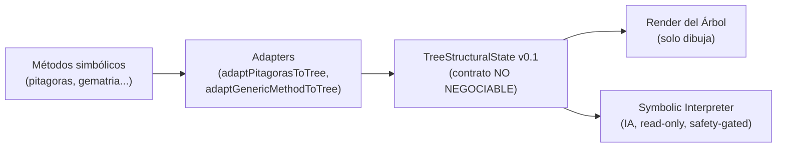
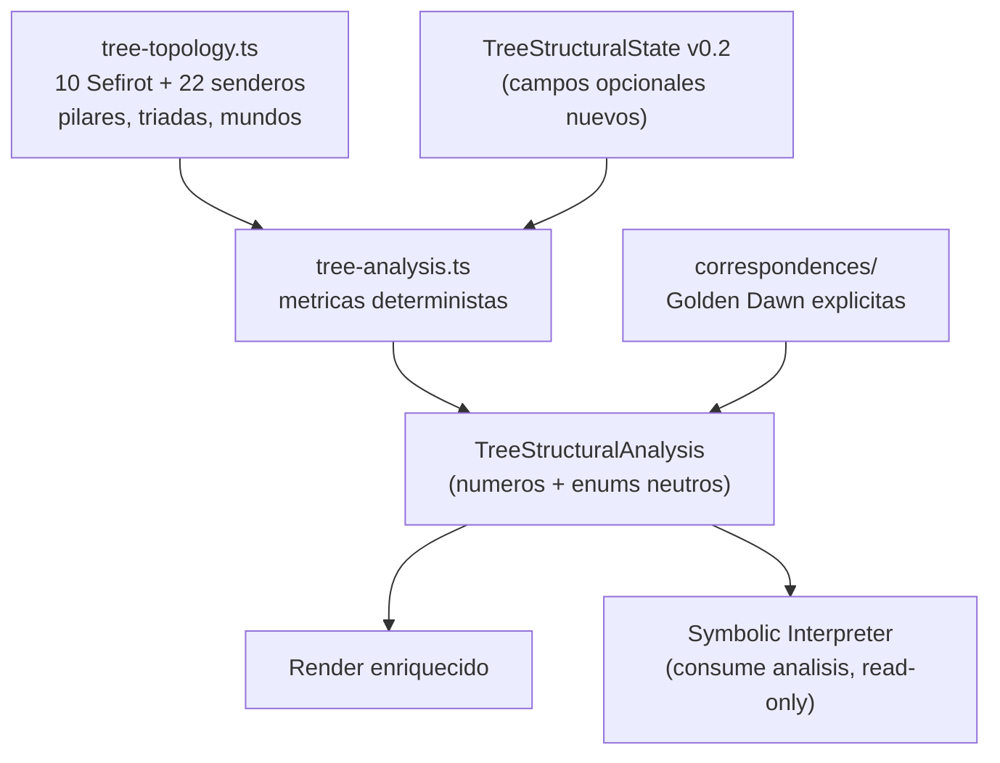

# Plan Fase 1 — Upgrade del Árbol de la Vida (packages/symbolic/tree)

<aside>
🎯

**Documento de implementación · Audiencia: agentes que ejecutarán el upgrade.**

Objetivo de la Fase 1: hacer el módulo del Árbol de la Vida en `packages/symbolic/tree/` **mucho más explícito, rico y analítico**, sin romper el contrato `TreeStructuralState` ni las reglas de `SOURCE_OF_TRUTH.md`. **TypeScript-only en esta fase. Sin migración a Python.**

</aside>

## 0. Reglas innegociables (leer antes de tocar código)

<aside>
⛔

Estas reglas vienen de `SOURCE_OF_TRUTH.md` y de `symbolic-interpreter.types.ts`. **Cualquier PR que las viole se rechaza.**

- ❌ NO diagnóstico clínico · NO etiquetas psicológicas · NO consejos personales · NO determinismo (`siempre`, `nunca`, `debes`).
- ❌ NO lectura holística ni conclusiones de "bueno / malo".
- ✅ SOLO observaciones **estructural-simbólicas**.
- ✅ Acceso **READ-ONLY** a `TreeStructuralState`. Sin datos personales en esta capa.
- ✅ La capa nueva de **análisis** es **determinista y computacional** (números y enums neutros). La **interpretación** (texto, IA) sigue aislada y validada por seguridad.
</aside>

## 1. Estado actual del módulo

Arquitectura vigente (confirmada en el repo):



Archivos actuales en `packages/symbolic/tree/`:

| Archivo | Rol actual |
| --- | --- |
| `tree-structural-state.types.ts` | Contrato `TreeStructuralState v0.1`: 10 Sefirot (`activation 0..1`, `role`), `flows` (`polarity`, `intensity`, `direction`). Solo estructura, sin interpretación. |
| `symbolic-interpreter.types.ts` | Tipos de la lectura IA + reglas de seguridad y términos prohibidos. |
| `symbolic-interpreter.ts` | `generateSymbolicInterpretation`, `validateTreeStateForInterpretation`, `createFallbackInterpretation`. |
| `pitagoras-tree-adapter.ts` · `generic-method-adapter.ts` | Convierten estados de métodos a `TreeStructuralState`. |
| `index.ts` | Exports públicos del módulo. |
| `../correspondences/` (`types.ts`, `resolve.ts`, `index.ts`) | Correspondencias simbólicas + resolución. |

<aside>
🔎

**Diagnóstico clave:** el estado actual es **estructural pero pobre**. Solo describe activación de Sefirot y flujos sueltos. **No hay topología explícita** (los 22 senderos, pilares, tríadas, mundos) ni **métricas analíticas** (equilibrio de pilares, conectividad, centralidad, balance de polaridades). La Fase 1 añade esa riqueza **de forma aditiva**, sin romper v0.1.

</aside>

## 2. Objetivo y principios de diseño

1. **Aditivo y retrocompatible.** `TreeStructuralState v0.1` no cambia sus campos requeridos. Se evoluciona a **v0.2** solo con campos **opcionales** + un objeto de análisis **separado**.
2. **Separación estricta de capas:**
    - **Topología** (datos estáticos canónicos) → `tree-topology.ts`
    - **Estado** (qué está activo ahora) → `TreeStructuralState`
    - **Análisis** (métricas deterministas derivadas) → `tree-analysis.ts`
    - **Interpretación** (texto/IA, gated) → `symbolic-interpreter.ts` (ya existe)
3. **El análisis NO interpreta.** Devuelve números y enums neutros. Nada de lenguaje valorativo.
4. **Determinista y puro.** Mismas entradas ⇒ mismas salidas. Sin efectos secundarios, sin red, sin fecha/azar dentro del cálculo. Memoizar con cachés puras.
5. **Base Hermética (Golden Dawn)** como sistema de correspondencias de la Fase 1. El enriquecimiento de Cábala Judía queda para fase posterior (no mezclar ahora).

## 3. Arquitectura objetivo (Fase 1)



## 4. Cambios por archivo

### 4.1 NUEVO — `tree-topology.ts` (datos canónicos)

Fuente única de verdad de la **estructura fija** del Árbol. Datos, no lógica.

```tsx
export type PillarId = 'severity' | 'mercy' | 'equilibrium'; // izquierda / derecha / central
export type TriadId = 'supernal' | 'ethical' | 'astral'; // + malchut como receptáculo
export type OlamId = 'atziluth' | 'beriah' | 'yetzirah' | 'assiah'; // 4 mundos

/** Los 22 senderos canónicos del Árbol (Golden Dawn) */
export interface TreePath {
  id: string;                 // ej: 'keter-chokmah'
  from: SefiraId;
  to: SefiraId;
  hebrewLetter: string;       // letra asociada (dato, no interpretación)
  pathNumber: number;         // 11..32 en numeración Golden Dawn
}

export const SEFIROT_TOPOLOGY: Record<SefiraId, {
  pillar: PillarId;
  triad: TriadId | 'receptacle';
  olam: OlamId;
  position: { x: number; y: number }; // layout canónico para render
}> ;

export const TREE_PATHS: readonly TreePath[]; // exactamente 22
```

<aside>
✅

**Criterio:** `TREE_PATHS.length === 22` y `Object.keys(SEFIROT_TOPOLOGY).length === 10`, validados por test. Sin esto, nada de grafo es fiable.

</aside>

### 4.2 EVOLUCIÓN — `tree-structural-state.types.ts` (v0.1 → v0.2, aditivo)

No se tocan los campos requeridos. Se añaden **opcionales**:

```tsx
export interface TreeSefirah {
  id: SefiraId;
  activation: number;
  role: SefiraRole;
  // NUEVO (opcional, retrocompatible):
  pillar?: PillarId;
  triad?: TriadId | 'receptacle';
  olam?: OlamId;
}

export interface TreeFlow {
  from: SefiraId;
  to: SefiraId;
  polarity: FlowPolarity;
  intensity: number;
  direction: FlowDirection;
  // NUEVO (opcional): vincula el flujo a un sendero canónico
  pathId?: string;            // referencia a TreePath.id
}
```

Actualizar `TREE_STRUCTURAL_STATE_META.version` a `'0.2'` y documentar en el comentario de cabecera que **los nuevos campos son opcionales y no alteran la invariante "el Árbol no interpreta"**.

### 4.3 NUEVO — `tree-analysis.types.ts` y `tree-analysis.ts` (capa analítica)

Métricas **deterministas y neutras** derivadas del estado + topología:

```tsx
export interface TreeStructuralAnalysis {
  sourceVersion: string;      // '0.2'
  // Distribución de activación por pilar (suma normalizada 0..1)
  pillarBalance: Record<PillarId, number>;
  // Activación agregada por tríada y por mundo
  triadActivation: Record<TriadId | 'receptacle', number>;
  olamActivation: Record<OlamId, number>;
  // Distribución de polaridades de los flujos activos
  polarityDistribution: Record<FlowPolarity, number>;
  // Métricas de grafo sobre los senderos activos
  graph: {
    activeNodes: SefiraId[];
    activePaths: string[];        // pathId
    degreeCentrality: Record<SefiraId, number>;
    connectedComponents: number;
    longestActivePath?: string[]; // secuencia de SefiraId
  };
  // Sefirot ordenadas por activación (sin etiqueta de valor)
  ranking: { id: SefiraId; activation: number; role: SefiraRole }[];
}

export function analyzeTreeState(
  state: TreeStructuralState
): TreeStructuralAnalysis;
```

<aside>
📐

**Grafo en TS (sin NetworkX).** En esta fase implementar las métricas con algoritmos propios y deterministas sobre `TREE_PATHS` (grado/centralidad por conteo, componentes con BFS/Union-Find, camino más largo con DFS acotado a 22 aristas). **Cero dependencias nuevas.** Memoizar con caché pura por hash del estado. NetworkX/Python queda para una fase futura solo si el análisis crece.

</aside>

<aside>
⛔

**Prohibido en el análisis:** etiquetas como `"débil"`, `"bloqueado"`, `"sano"`, `"problema"`. Solo magnitudes (`number`) y enums ya definidos (`role`, `polarity`). Si necesitas nombrar un patrón, usa un enum neutro nuevo y documentado, nunca prosa valorativa.

</aside>

### 4.4 ENRIQUECER — `../correspondences/` (Golden Dawn explícitas)

- Ampliar `types.ts` para cubrir, por **Sefirá** y por **sendero**, correspondencias herméticas explícitas: letra hebrea, planeta/luminar, elemento, color de escala, arcano del Tarot (solo **dato**, sin lectura).
- Cargar como **datos validados** (estructura tipada). Mantener `resolve.ts` como única API de acceso (`resolveSefirahCorrespondences(id)`, `resolvePathCorrespondences(pathId)`).
- Regla: **datos separados de lógica.** Las correspondencias son tablas, no código condicional.

### 4.5 ACTUALIZAR — adaptadores

`pitagoras-tree-adapter.ts` y `generic-method-adapter.ts` deben **poblar los nuevos campos opcionales** (`pillar`, `triad`, `olam`, `pathId`) usando `tree-topology.ts`. No deben calcular métricas (eso es de `tree-analysis.ts`).

### 4.6 ACTUALIZAR — `symbolic-interpreter.ts`

- Permitir que el intérprete **consuma `TreeStructuralAnalysis`** como entrada read-only para generar observaciones mejor fundamentadas.
- Mantener intactas las reglas de seguridad y el filtro de `prohibitedTerms`. El análisis le da estructura; **no le da permiso para interpretar de más**.

### 4.7 ACTUALIZAR — `index.ts`

Exportar lo nuevo: tipos y constantes de `tree-topology.ts`, `tree-analysis.types.ts`, y la función `analyzeTreeState`.

## 5. Plan de ejecución por PRs (orden recomendado)

| PR | Contenido | Depende de |
| --- | --- | --- |
| PR-1 | `tree-topology.ts`  • tests de invariantes (10 Sefirot, 22 senderos) | — |
| PR-2 | Contrato v0.2 (campos opcionales) + bump de versión + tests de retrocompatibilidad | PR-1 |
| PR-3 | `tree-analysis.types.ts`  • `tree-analysis.ts`  • golden tests | PR-1, PR-2 |
| PR-4 | Enriquecimiento de `correspondences/` (Golden Dawn) + tests de resolución | PR-1 |
| PR-5 | Adaptadores poblando campos nuevos | PR-2, PR-4 |
| PR-6 | Integración del análisis en `symbolic-interpreter.ts` (read-only, gated) | PR-3 |
| PR-7 | Docs: actualizar `04_SYMBOLIC_SYSTEM`  • README del módulo | todos |

<aside>
🔒

**Regla de oro de la migración:** no tocar código fuera de `packages/symbolic/tree/` y `packages/symbolic/correspondences/`. No tocar el backend Django ni `backend/cabala_py/` en esta fase. PRs pequeños y revisables.

</aside>

## 6. Testing y criterios de aceptación

- [ ]  **Invariantes de topología:** 10 Sefirot, 22 senderos, pilares/tríadas/mundos asignados a cada Sefirá.
- [ ]  **Retrocompatibilidad:** un `TreeStructuralState v0.1` (sin campos nuevos) sigue siendo válido y renderizable.
- [ ]  **Determinismo:** `analyzeTreeState` produce salida idéntica byte a byte para la misma entrada (golden tests).
- [ ]  **Pureza:** sin red, sin `Date.now()` ni aleatoriedad dentro del cálculo de análisis.
- [ ]  **Seguridad (lint):** test que escanea las salidas de análisis y rechaza cualquier `prohibitedTerm` de `SYMBOLIC_INTERPRETER_META`.
- [ ]  **Cobertura:** cada función de `tree-analysis.ts` con su test unitario (casos: árbol vacío, una Sefirá, árbol totalmente activo, flujos desconectados).
- [ ]  **Correspondencias:** `resolve` devuelve datos completos para las 10 Sefirot y los 22 senderos.
- [ ]  **Tipado estricto:** `tsc --noEmit` sin errores; sin `any` en las nuevas APIs públicas.

## 7. Definición de "Done" (Fase 1)

<aside>
🏁

La Fase 1 está terminada cuando: el módulo expone topología canónica (10+22), un `TreeStructuralAnalysis` determinista y neutro, correspondencias Golden Dawn explícitas vía `resolve`, adaptadores que pueblan los campos v0.2, el intérprete consumiendo el análisis bajo sus reglas de seguridad, y toda la suite de tests (incluido el lint de términos prohibidos) en verde — **sin tocar Django, sin migrar a Python y sin romper v0.1**.

</aside>

## 8. Fuera de alcance de la Fase 1 (para evitar scope creep)

- Enriquecimiento de Cábala Judía Tradicional (Tikkun, Shevirah, Ein Sof) → fase posterior, módulo aparte.
- Cualquier migración de lógica a Python / `backend/cabala_py/` o consolidación de duplicados.
- Endpoints nuevos (DRF/FastAPI) o cambios de backend.
- Texto interpretativo adicional fuera del intérprete ya existente.

## 9. Prompts de arranque por PR (listos para pegar)

<aside>
📋

Cada bloque es un brief autónomo para el agente que ejecuta ese PR. Pegar el **preámbulo común** + el prompt del PR correspondiente. Respetar el orden de dependencias de la sección 5.

</aside>

### Preámbulo común (pegar SIEMPRE primero)

```
Eres un ingeniero senior de TypeScript trabajando en el repo
TonyBlanco/analisis_cabalistico_alma, módulo packages/symbolic/tree/.

CONTEXTO:
- El motor simbólico del Árbol de la Vida está en TypeScript (NO migrar a Python).
- Backend clínico en Django: NO tocarlo. NO tocar backend/cabala_py/.
- Contrato vigente: TreeStructuralState v0.1 (tree-structural-state.types.ts).
- Existe un intérprete IA read-only con reglas de seguridad estrictas
  (symbolic-interpreter.types.ts → SYMBOLIC_INTERPRETER_META.prohibitedTerms).

REGLAS INNEGOCIABLES (de SOURCE_OF_TRUTH.md):
- ❌ NO diagnóstico clínico, etiquetas psicológicas, consejos personales.
- ❌ NO determinismo (siempre/nunca/debes) ni "bueno/malo".
- ✅ SOLO estructura simbólica. La capa de análisis es determinista y neutra
  (números + enums). Sin red, sin Date.now(), sin azar dentro del cálculo.
- ✅ Cambios ADITIVOS y retrocompatibles. No romper v0.1.
- ✅ Solo tocar packages/symbolic/tree/ y packages/symbolic/correspondences/.
- ✅ tsc --noEmit sin errores. Sin `any` en APIs públicas nuevas.

ENTREGABLE: PR pequeño y revisable, con tests, sin tocar nada fuera de alcance.
```

### PR-1 — Topología canónica

```
TAREA (PR-1): Crear packages/symbolic/tree/tree-topology.ts como fuente única
de la estructura fija del Árbol (datos, no lógica).

DEBES DEFINIR:
- PillarId ('severity' | 'mercy' | 'equilibrium')
- TriadId ('supernal' | 'ethical' | 'astral'), más 'receptacle' para malchut
- OlamId ('atziluth' | 'beriah' | 'yetzirah' | 'assiah')
- interface TreePath { id; from; to; hebrewLetter; pathNumber }
- SEFIROT_TOPOLOGY: Record<SefiraId, { pillar; triad|'receptacle'; olam; position{x,y} }>
- TREE_PATHS: readonly TreePath[]  // EXACTAMENTE los 22 senderos Golden Dawn

TESTS (obligatorios):
- Object.keys(SEFIROT_TOPOLOGY).length === 10
- TREE_PATHS.length === 22
- Cada path.from/to es un SefiraId válido; pathNumber único en 11..32
- Cada Sefirá tiene pillar, triad/receptacle y olam asignados

NO calcular métricas aquí. Solo datos + tipos.
```

### PR-2 — Contrato v0.2 (aditivo)

```
TAREA (PR-2): Evolucionar tree-structural-state.types.ts de v0.1 a v0.2 SIN
romper retrocompatibilidad. Solo añadir campos OPCIONALES.

CAMBIOS:
- TreeSefirah: añadir pillar?, triad?, olam? (tipos de tree-topology.ts)
- TreeFlow: añadir pathId?  (referencia a TreePath.id)
- Actualizar TREE_STRUCTURAL_STATE_META.version a '0.2'
- Documentar en cabecera: los campos nuevos son opcionales y NO alteran la
  invariante "el Árbol no interpreta".

TESTS:
- Un objeto TreeStructuralState v0.1 (sin campos nuevos) sigue compilando y
  siendo válido (test de retrocompatibilidad).
- Tipos nuevos importan correctamente desde tree-topology.ts sin ciclos.

DEPENDE DE: PR-1.
```

### PR-3 — Capa de análisis determinista

```
TAREA (PR-3): Crear tree-analysis.types.ts y tree-analysis.ts con métricas
DETERMINISTAS y NEUTRAS derivadas de TreeStructuralState + topología.

DEFINIR TreeStructuralAnalysis con:
- pillarBalance: Record<PillarId, number>            // normalizado 0..1
- triadActivation: Record<TriadId|'receptacle', number>
- olamActivation: Record<OlamId, number>
- polarityDistribution: Record<FlowPolarity, number>
- graph: { activeNodes; activePaths; degreeCentrality;
           connectedComponents; longestActivePath? }
- ranking: { id; activation; role }[]

Función: analyzeTreeState(state): TreeStructuralAnalysis

GRAFO (sin dependencias): implementar sobre TREE_PATHS
- grado/centralidad por conteo
- componentes conexas con BFS o Union-Find
- camino activo más largo con DFS acotado (máx 22 aristas)
Memoizar con caché pura por hash del estado.

PROHIBIDO: etiquetas valorativas ('débil', 'bloqueado', 'sano', 'problema').
Solo números y enums ya definidos.

TESTS (golden + unitarios): árbol vacío, una Sefirá, árbol totalmente activo,
flujos desconectados. Verificar determinismo (salida idéntica para misma entrada).

DEPENDE DE: PR-1, PR-2.
```

### PR-4 — Correspondencias Golden Dawn

```
TAREA (PR-4): Enriquecer packages/symbolic/correspondences/ con correspondencias
herméticas EXPLÍCITAS (Golden Dawn), como DATOS validados.

CAMBIOS:
- Ampliar types.ts: por Sefirá y por sendero → letra hebrea, planeta/luminar,
  elemento, color de escala, arcano del Tarot (SOLO dato, sin lectura).
- Mantener resolve.ts como única API:
    resolveSefirahCorrespondences(id)
    resolvePathCorrespondences(pathId)
- Datos en tablas tipadas, separados de la lógica. Nada de condicionales sobre
  significado.

TESTS: resolve devuelve datos completos para las 10 Sefirot y los 22 senderos.

DEPENDE DE: PR-1.
```

### PR-5 — Adaptadores poblando v0.2

```
TAREA (PR-5): Actualizar pitagoras-tree-adapter.ts y generic-method-adapter.ts
para POBLAR los campos opcionales nuevos (pillar, triad, olam en Sefirot; pathId
en flows) usando tree-topology.ts.

RESTRICCIONES:
- Los adaptadores NO calculan métricas (eso es de tree-analysis.ts).
- La salida sigue siendo un TreeStructuralState válido (ahora v0.2).
- Mapear cada flow a su pathId canónico cuando exista en TREE_PATHS.

TESTS: dado un estado de entrada conocido, los campos nuevos se rellenan según
la topología; estados sin correspondencia de sendero dejan pathId undefined.

DEPENDE DE: PR-2, PR-4.
```

### PR-6 — Integración en el intérprete

```
TAREA (PR-6): Permitir que symbolic-interpreter.ts CONSUMA TreeStructuralAnalysis
como entrada read-only para fundamentar mejor sus observaciones.

RESTRICCIONES (CRÍTICO):
- El intérprete sigue siendo read-only y safety-gated.
- NO relajar SYMBOLIC_INTERPRETER_META.prohibitedTerms ni las reglas de seguridad.
- El análisis aporta estructura; NO habilita interpretación de más.
- safetyValidation debe seguir ejecutándose sobre toda salida.

TESTS:
- Una interpretación generada a partir del análisis sigue pasando el filtro de
  términos prohibidos.
- Inyectar un término prohibido provoca containsProhibitedContent / warning.

DEPENDE DE: PR-3.
```

### PR-7 — Documentación

```
TAREA (PR-7): Actualizar la documentación del sistema simbólico.

CAMBIOS:
- Actualizar docs/04_SYMBOLIC_SYSTEM con la arquitectura v0.2 (topología,
  análisis, correspondencias, integración con el intérprete).
- Crear/actualizar README del módulo packages/symbolic/tree/ con: capas,
  contrato v0.2, cómo usar analyzeTreeState, y las reglas de seguridad.
- Reflejar que NO hubo migración a Python ni cambios de backend.

DEPENDE DE: todos los PR anteriores.
```

## 10. PR de corrección — bloqueantes detectados en la revisión

<aside>
🛠️

**Contexto:** revisión del código ya subido a `main` (commits `2850387d` + `a3272b27`). La Fase 1 está casi completa, pero hay **3 bloqueantes** que impiden dar por buena la entrega: el contrato no compila con los adaptadores, las correspondencias no resuelven por choque de nomenclatura, y `resolve.ts` introduce fuentes de verdad paralelas. Pegar el **preámbulo común** (sección 9) + este prompt.

</aside>

```
TAREA (PR-FIX-1): Corregir 3 bloqueantes detectados en revisión de la Fase 1
en packages/symbolic/tree/ y packages/symbolic/correspondences/.
NO migrar a Python. NO tocar Django ni backend/cabala_py/. Cambios mínimos.

──────────────────────────────────────────────────────────────────────────
BLOQUEANTE 1 — El contrato sigue en v0.1 pero los adaptadores escriben v0.2
──────────────────────────────────────────────────────────────────────────
Síntoma: tree-structural-state.types.ts está en v0.1 (TreeSefirah = {id,
activation, role}; TreeFlow sin pathId; TREE_STRUCTURAL_STATE_META.version
=== '0.1'). Pero pitagoras-tree-adapter.ts (enrichSefirah / enrichFlow) y
generic-method-adapter.ts devuelven objetos con pillar/triad/olam/pathId.
Eso NO compila (TS2353: propiedades desconocidas) y tree-analysis.ts emite
sourceVersion '0.2' contra un contrato '0.1'.

ARREGLO:
- En tree-structural-state.types.ts añadir campos OPCIONALES (aditivo):
    TreeSefirah: pillar?, triad?, olam?  (tipos importados de tree-topology.ts)
    TreeFlow: pathId?
- Cambiar TREE_STRUCTURAL_STATE_META.version a '0.2'.
- Documentar en cabecera: campos nuevos opcionales, NO alteran la invariante
  "el Árbol no interpreta". Evitar ciclos de import con tree-topology.ts.
TEST: un TreeStructuralState v0.1 (sin campos nuevos) sigue compilando y siendo
válido. tsc --noEmit sin errores en todo packages/symbolic/.

──────────────────────────────────────────────────────────────────────────
BLOQUEANTE 2 — Choque de nomenclatura keter/malchut vs kether/malkuth
──────────────────────────────────────────────────────────────────────────
Síntoma: tree-topology.ts usa SefiraId 'keter'..'malchut' e ids de sendero
como 'yesod-malchut'. correspondences/types.ts + golden-dawn-data.ts usan un
tipo PARALELO SefirahId 'kether'..'malkuth' e ids 'kether-*' / '*-malkuth'.
Resultado: resolveSefirahCorrespondences('keter') y
resolvePathCorrespondences('yesod-malchut') devuelven null (2 Sefirot y 6
senderos no resuelven al cruzarse con la topología).

ARREGLO:
- Unificar en la nomenclatura CANÓNICA del contrato: 'keter' y 'malchut'
  (y senderos 'keter-*', '*-malchut').
- En correspondences/: NO declarar un SefirahId propio; reutilizar SefiraId
  del contrato. Alinear las claves de SEFIRAH_CORRESPONDENCES y
  PATH_CORRESPONDENCES y el tipo TreePathId a esa nomenclatura.
TEST: para los 10 ids de SefiraId y los 22 TreePath.id de tree-topology.ts,
resolveSefirahCorrespondences / resolvePathCorrespondences devuelven dato no
nulo (sin null en ninguno de los 32).

──────────────────────────────────────────────────────────────────────────
BLOQUEANTE 3 — resolve.ts usa fuentes de verdad paralelas
──────────────────────────────────────────────────────────────────────────
Síntoma: resolve.ts importa HEBREW_LETTERS de ../cabala/letters, TREE_PATHS de
../cabala/paths (¡un TERCER TREE_PATHS con .letterId!) y ARCANOS_MAYORES de
../tarot/arcanos, conviviendo con golden-dawn-data.ts y con el TREE_PATHS de
tree-topology.ts. Múltiples tablas de senderos = fuentes de verdad en conflicto
(y posible fallo de compilación si esos módulos no existen).

ARREGLO:
- tree-topology.ts es la ÚNICA fuente de la estructura (Sefirot + 22 senderos).
- golden-dawn-data.ts es la única fuente de correspondencias herméticas.
- Eliminar la dependencia de ../cabala/paths para la estructura; derivar de
  TREE_PATHS de tree-topology.ts. Si ../cabala/letters y ../tarot/arcanos son
  necesarios, mantenerlos SOLO como dato hermético, sin duplicar la topología.
TEST: no existe más de una definición de los 22 senderos; tsc --noEmit limpio.

──────────────────────────────────────────────────────────────────────────
VERIFICACIÓN FINAL (obligatoria antes de cerrar el PR)
──────────────────────────────────────────────────────────────────────────
- tsc --noEmit sin errores en packages/symbolic/.
- Suite de tests en verde, incluido el lint de términos prohibidos.
- Confirmar que NO se tocó nada fuera de packages/symbolic/tree/ y
  packages/symbolic/correspondences/.
- Reportar los hashes de commit nuevos al terminar.
```