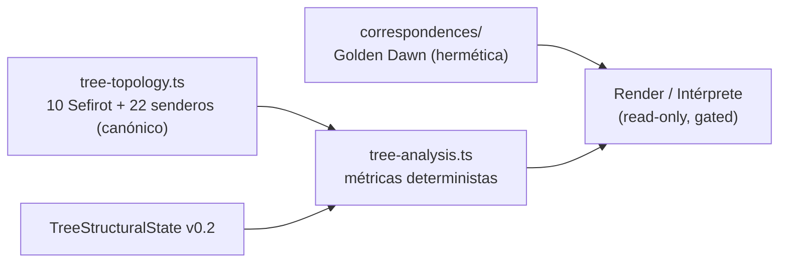
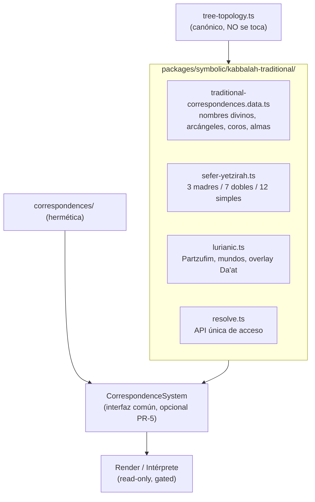

# Plan Fase 2 — Cábala Judía Tradicional (nuevo módulo packages/symbolic/kabbalah-traditional)

<aside>
🎯

**Documento de implementación · Audiencia: agentes que ejecutarán la Fase 2.**

Objetivo: añadir un **módulo nuevo y separado** de **Cábala Judía Tradicional** (`packages/symbolic/kabbalah-traditional/`) que enriquezca el Árbol con el sistema tradicional (nombres divinos, arcángeles, coros, almas, Sefer Yetzirah, cosmología luriánica), **sin tocar la Fase 1**, **sin alterar la topología canónica de 10 Sefirot** y **sin romper el contrato v0.2**. **TypeScript-only. Sin migración a Python.**

</aside>

## 0. Reglas innegociables (leer antes de tocar código)

<aside>
⛔

Heredan de `SOURCE_OF_TRUTH.md` y de la Fase 1. **Cualquier PR que las viole se rechaza.**

- ❌ NO diagnóstico clínico · NO etiquetas psicológicas · NO consejos personales · NO determinismo (`siempre`, `nunca`, `debes`).
- ❌ NO lectura holística ni conclusiones de "bueno / malo".
- ✅ SOLO datos **estructural-simbólicos** y correspondencias tradicionales como **tablas**, no como lógica condicional sobre significado.
- ✅ Acceso **READ-ONLY**. Sin datos personales en esta capa.
- ✅ **`tree-topology.ts` sigue siendo la ÚNICA fuente de la estructura** (10 Sefirot + 22 senderos). Este módulo **NO define otra topología**: solo añade correspondencias keyeadas por `SefiraId` y `TreePath.id` canónicos.
- ✅ **Da'at** se trata como **overlay opcional no renderizado por defecto**. NO entra en `SEFIROT_TOPOLOGY` ni rompe la invariante de 10 Sefirot.
- ✅ Conceptos luriánicos (Tzimtzum, Shevirat haKelim, Tikkun, Ein Sof) entran como **datos de referencia neutros**, NUNCA aplicados como interpretación a la lectura de una persona.
</aside>

## 1. Punto de partida (tras la Fase 1)

La Fase 1 dejó la estructura canónica y la capa analítica listas; la hermética (Golden Dawn) vive en `packages/symbolic/correspondences/`.



<aside>
🔎

**Diagnóstico:** hoy solo existe **un** sistema de correspondencias (hermético). La Fase 2 añade un **segundo sistema** (tradicional judío) como **módulo paralelo**, reutilizando exactamente los mismos `SefiraId` y `TreePath.id`. Ambos sistemas deben poder coexistir y seleccionarse sin pisarse.

</aside>

## 2. Objetivo y principios de diseño

1. **Módulo nuevo y aislado.** Todo el trabajo vive en `packages/symbolic/kabbalah-traditional/`. No se modifica `tree/` ni `correspondences/` (salvo la abstracción opcional del PR-5).
2. **Reusar la fuente de verdad.** Importar `SefiraId`, `OlamId`, `TREE_PATHS` y `TreePath` de `tree-topology.ts`. **Prohibido** redefinir la estructura del Árbol.
3. **Datos separados de lógica.** Las correspondencias tradicionales son **tablas tipadas**; `resolve.ts` es la única API de acceso.
4. **Determinista y puro.** Sin red, sin `Date.now()`, sin azar. Mismo input ⇒ mismo output.
5. **Paralelo a la hermética, no sustituto.** Misma forma de API que `correspondences/resolve.ts` para que el pipeline pueda elegir sistema.
6. **Seguridad primero.** Nombres divinos, arcángeles y conceptos luriánicos son **dato de referencia**, nunca afirmaciones sobre la persona.

## 3. Arquitectura objetivo (Fase 2)



## 4. Cambios por archivo (todo NUEVO salvo la abstracción opcional)

### 4.1 `traditional-correspondences.types.ts`

Tipos de las correspondencias tradicionales, keyeadas por `SefiraId` canónico.

```tsx
import type { SefiraId, OlamId } from '../tree/tree-topology';

export type SoulPart = 'nefesh' | 'ruach' | 'neshamah' | 'chayah' | 'yechidah';

export interface TraditionalSefirahData {
  id: SefiraId;
  divineNameHebrew: string;   // p.ej. 'אהיה'
  divineNameTranslit: string; // p.ej. 'Eheieh'
  archangel: string;          // p.ej. 'Metatron'
  angelicChoir: string;       // p.ej. 'Chayot ha-Kodesh'
  olam: OlamId;               // mundo (coincide con la topología)
}

export interface SoulLevelData {
  part: SoulPart;
  olam: OlamId | 'adam_kadmon';
  hebrew: string;
}
```

### 4.2 `traditional-correspondences.data.ts`

Tablas de datos (10 Sefirot + niveles del alma). Sin lógica.

| Sefirá | Nombre divino | Arcángel | Coro angélico | Mundo |
| --- | --- | --- | --- | --- |
| Keter | אהיה · Eheieh | Metatron | Chayot ha-Kodesh | atziluth |
| Chokmah | יה · Yah | Raziel | Ophanim | beriah |
| Binah | יהוה אלהים · YHVH Elohim | Tzaphkiel | Aralim | beriah |
| Chesed | אל · El | Tzadkiel | Chashmalim | yetzirah |
| Gevurah | אלהים גבור · Elohim Gibor | Khamael | Seraphim | yetzirah |
| Tiferet | יהוה אלוה ודעת · YHVH Eloah va-Daat | Raphael | Malachim | yetzirah |
| Netzach | יהוה צבאות · YHVH Tzevaot | Haniel | Elohim | yetzirah |
| Hod | אלהים צבאות · Elohim Tzevaot | Michael | Bene Elohim | yetzirah |
| Yesod | שדי אל חי · Shaddai El Chai | Gabriel | Kerubim | yetzirah |
| Malchut | אדני הארץ · Adonai ha-Aretz | Sandalphon | Ishim | assiah |

<aside>
ℹ️

**Niveles del alma** (mapeados por mundo, no por Sefirá individual): `nefesh`→assiah, `ruach`→yetzirah, `neshamah`→beriah, `chayah`→atziluth, `yechidah`→adam_kadmon. Dato de referencia, sin interpretación.

</aside>

### 4.3 `sefer-yetzirah.ts` (clasificación de las 22 letras)

Clasifica las letras de los 22 senderos canónicos según el Sefer Yetzirah. Deriva de `TREE_PATHS` (mismas letras), no redefine senderos.

```tsx
export type LetterClass = 'mother' | 'double' | 'simple';

export interface SeferYetzirahLetter {
  hebrewLetter: string;     // coincide con TreePath.hebrewLetter
  letterClass: LetterClass;
  attribution: string;      // madre→elemento, doble→planeta, simple→signo (dato)
}
```

<aside>
✅

**Invariante (test):** 3 madres (א Aire, מ Agua, ש Fuego) + 7 dobles (ב ג ד כ פ ר ת) + 12 simples = **22**, y el conjunto de letras coincide exactamente con las de `TREE_PATHS`.

</aside>

### 4.4 `lurianic.ts` (Partzufim, mundos, overlay Da'at)

Datos estructurales luriánicos **neutros**. Nada se aplica a personas.

```tsx
import type { SefiraId } from '../tree/tree-topology';

export type PartzufId =
  | 'arich_anpin' | 'abba' | 'imma' | 'zeir_anpin' | 'nukva';

/** Mapeo Partzuf → Sefirot que lo componen (dato canónico). */
export const PARTZUFIM: Record<PartzufId, SefiraId[]>;

/** Conceptos cosmológicos como referencia (label + definición neutra). */
export const LURIANIC_CONCEPTS: ReadonlyArray<{ id: string; hebrew: string; note: string }>;
// Tzimtzum, Shevirat haKelim, Tikkun, Ein Sof — SOLO referencia, no interpretación.

/** Da'at como overlay OPCIONAL, fuera de SEFIROT_TOPOLOGY. */
export const DAAT_OVERLAY: {
  id: 'daat';
  hidden: true;
  position: { x: number; y: number };
  between: [SefiraId, SefiraId, SefiraId]; // chokmah, binah, tiferet
};
```

<aside>
⛔

**Da'at no toca la topología.** No se añade a `SEFIROT_TOPOLOGY`, no cuenta para la invariante de 10, no entra en `tree-analysis.ts`. Es un overlay opcional para el render avanzado.

</aside>

### 4.5 `resolve.ts` (API única de acceso)

```tsx
export function resolveTraditionalSefirah(id: SefiraId): TraditionalSefirahData | null;
export function resolveTraditionalPath(pathId: string): SeferYetzirahLetter | null;
export function resolvePartzuf(id: SefiraId): PartzufId | null;
```

### 4.6 `index.ts`

Exports públicos del módulo (tipos, tablas y funciones de `resolve`).

### 4.7 (OPCIONAL · PR-5) `correspondences/system.ts` — abstracción común

Interfaz `CorrespondenceSystem` que **tanto la hermética como la tradicional** implementan, para que el pipeline elija sistema por nombre.

```tsx
export type SystemId = 'hermetic-golden-dawn' | 'jewish-traditional';
export interface CorrespondenceSystem {
  id: SystemId;
  sefirah(id: SefiraId): unknown | null;
  path(pathId: string): unknown | null;
}
```

<aside>
🔒

Esta abstracción es **aditiva**: la hermética sigue funcionando igual; solo se le añade una fachada que cumple la interfaz. Si introduce cualquier riesgo de regresión, se pospone.

</aside>

## 5. Plan de ejecución por PRs

| PR | Contenido | Depende de |
| --- | --- | --- |
| PR-1 | Módulo base: `types.ts`  • `data.ts` (nombres divinos, arcángeles, coros, almas) + tests de cobertura (10 Sefirot) | Fase 1 cerrada |
| PR-2 | `sefer-yetzirah.ts` (3 madres / 7 dobles / 12 simples) mapeado a las letras de `TREE_PATHS`  • tests (3+7+12=22) | PR-1 |
| PR-3 | `lurianic.ts` (Partzufim, niveles del alma, overlay Da'at) como datos neutros + tests | PR-1 |
| PR-4 | `resolve.ts`  • `index.ts` (API única) + tests de resolución (10 Sefirot + 22 senderos, sin `null`) | PR-1, PR-2, PR-3 |
| PR-5 (opcional) | `CorrespondenceSystem`  • selector hermético/tradicional; Golden Dawn implementa la interfaz | PR-4 |
| PR-6 | Integración read-only en `symbolic-interpreter.ts` (consume datos tradicionales bajo las reglas de seguridad) + lint términos prohibidos | PR-4 |
| PR-7 | Docs: `04_SYMBOLIC_SYSTEM`  • README del módulo | todos |

<aside>
🔒

**Regla de oro:** solo tocar `packages/symbolic/kabbalah-traditional/` (y, en PR-5, añadir `correspondences/system.ts`). NO tocar `tree/`, NO tocar Django ni `backend/cabala_py/`. PRs pequeños y revisables.

</aside>

## 6. Testing y criterios de aceptación

- [ ]  **Cobertura de datos:** las 10 Sefirot tienen nombre divino, arcángel, coro y mundo; el mundo coincide con `SEFIROT_TOPOLOGY`.
- [ ]  **Sefer Yetzirah:** 3 madres + 7 dobles + 12 simples = 22; el set de letras coincide con `TREE_PATHS`.
- [ ]  **Resolución:** `resolveTraditionalSefirah` y `resolveTraditionalPath` devuelven dato no nulo para los 10 `SefiraId` y los 22 `TreePath.id`.
- [ ]  **Da'at aislado:** `SEFIROT_TOPOLOGY` sigue con 10 entradas; `tree-analysis.ts` no cambia su salida.
- [ ]  **Pureza/determinismo:** sin red, sin `Date.now()`, sin azar.
- [ ]  **Seguridad (lint):** ninguna salida contiene términos prohibidos de `SYMBOLIC_INTERPRETER_META`; conceptos luriánicos solo como referencia.
- [ ]  **Tipado estricto:** `tsc --noEmit` sin errores; sin `any` en las APIs públicas nuevas.
- [ ]  **No regresión:** la hermética y la Fase 1 siguen pasando todos sus tests.

## 7. Definición de "Done" (Fase 2)

<aside>
🏁

La Fase 2 está terminada cuando el módulo `kabbalah-traditional/` expone correspondencias tradicionales completas (nombres divinos, arcángeles, coros, almas), la clasificación Sefer Yetzirah de las 22 letras, los datos luriánicos (Partzufim, mundos, overlay Da'at), y una API `resolve` que cubre 10 Sefirot + 22 senderos — todo determinista, neutro y bajo las reglas de seguridad — **sin tocar la Fase 1, sin migrar a Python y sin alterar la topología canónica**.

</aside>

## 8. Fuera de alcance de la Fase 2

- Aplicar Shevirat haKelim / Tikkun a la lectura de una persona (eso sería interpretación → prohibido).
- Cualquier migración a Python / `backend/cabala_py/` o cambios de backend.
- Redefinir o ampliar la topología (Da'at solo como overlay).
- Nuevos endpoints o texto interpretativo fuera del intérprete existente.
- Mezclar el sistema hermético y el tradicional en una sola tabla (se mantienen paralelos).