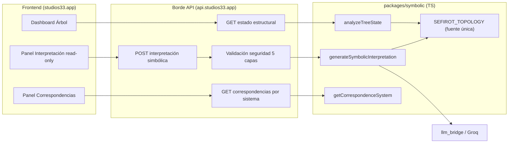
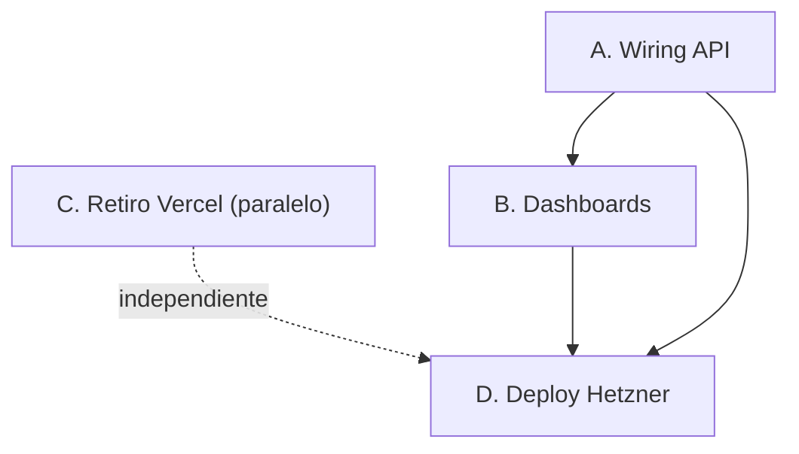

# Plan Maestro — Wiring + Dashboards + Salida a Producción (retiro de Vercel)

<aside>
🧭

**Objetivo de este plan:** llevar lo ya construido en `main` (Fase 1 — Árbol de la Vida, Fase 2 — Cábala judía tradicional, HEAD `3e2f0981`) desde *”código en local/repo”* hasta *”funcionando en producción”*. Cubre 4 frentes: **A) Wiring del motor simbólico**, **B) Dashboards faltantes**, **C) Retiro de Vercel**, **D) Deploy a Hetzner**.

Este documento es **arquitectura + asignación de trabajo**. La ejecución (código, deploy, ajustes de Vercel, push) la realizan los **agentes locales**. Yo no despliego, no hago push ni toco la cuenta de Vercel.

</aside>

> **Estado 2026-06-09 · main `0bd3c1c0` · prod Hetzner activa**
> C ✅ cerrado · A ✅ cerrado en main · B 🟡 parcial · D 🟡 prod viva, falta D5 smoke auth
> Pendiente merge: `191a6a4e` (B7), `b3e7d135` (FIX-3), `a42e45d0` (C2)

## 0. Estado de partida y alcance

**Hecho y verificado en `main`:**

- ✅ **Fase 1** — Árbol de la Vida `packages/symbolic/tree/` (contrato v0.2, topología única `SEFIROT_TOPOLOGY`, `analyzeTreeState`, intérprete simbólico read-only). Bloqueantes PR-FIX-1 resueltos (`0996e84e`).
- ✅ **Fase 2** — `packages/symbolic/kabbalah-traditional/` + selector `CorrespondenceSystem` (`hermetic-golden-dawn` | `jewish-traditional`). HEAD `3e2f0981`. Inyección read-only verificada en el prompt.

**Lo que falta (este plan):**

- ⬜ **Wiring**: el motor simbólico aún no está expuesto/consumido extremo a extremo (API ↔ frontend).
- ⬜ **Dashboards**: faltan paneles de visualización/interpretación.
- ⬜ **Vercel**: deploys en rojo de una integración que ya no se usa → retirar.
- ⬜ **Deploy live**: subir a Hetzner (`studios33.app` / `api.studios33.app`).

## 0.1 Reglas NO negociables (heredadas de la fuente de verdad)

<aside>
⛔

1. **Solo TypeScript** en el motor simbólico. **No** migrar a Python, **no** tocar Django `cabala_py` salvo el borde de exposición API.
2. **Seguridad simbólica**: NO diagnóstico, NO consejo personal, NO etiquetas psicológicas, NO determinismo. Solo observación estructural-simbólica, READ-ONLY, lenguaje educativo.
3. **Términos prohibidos** (filtro `validateSafetyContent`): diagnóstico, trastorno, patología, enfermedad, debes, tienes que, definitivamente, siempre, nunca.
4. **Sin texto literal de fuentes externas** (Sefaria): solo metadatos/mapeos; salida breve y original.
5. **Gobernanza `/docs`**: toda doc nueva va bajo la estructura canónica. Toda decisión queda en `.ai-memory/` con su etiqueta (`[DECISION]`, `[ENDPOINT]`, `[DEPLOY]`, `[SECURITY]`, `[BUG]`).
6. **SWM v3** (capa interpretativa AI) requiere gobernanza, consentimiento y trazabilidad. SWM v1 (visual) permanece canónico.
</aside>

## 1. Diagnóstico del repositorio (hallazgos)

| Hallazgo | Evidencia | Implicación |
| --- | --- | --- |
| No existe `vercel.json` en raíz | 404 en `/main/vercel.json` | Vercel no se configura por archivo → es la **integración GitHub App** |
| CI sin deploy | Workflows: `pip-ai-tests`, `playwright-e2e`, `validate-mappings` | El deploy a prod es **manual por Docker** |
| Docker presente | `Dockerfile`, `.dockerignore` | Base para el deploy a Hetzner |
| Cruft en raíz | `DASHBOARD-PROFESIONAL-NUEVO.tsx`, `.zip`, `.patch`, `COMMIT_SAVEPOINT_*`, `.tmp_symbolic_stub` | Consolidar/eliminar antes de prod |
| Memoria multi-agente | `.ai-memory/`, `AGENTS.md`, `.cursor/`, `.gemini/`, `.claude/` | Coordinar agentes vía esa memoria |

<aside>
🟡

**Supuestos a confirmar por los agentes en local** (no pude verlos desde fuera): ubicación exacta del frontend (framework/dir), si el borde de API es Django REST o un BFF Node, y la mecánica exacta de deploy (¿`docker compose` en el server?). El plan marca estos puntos como **[CONFIRMAR]**.

</aside>

## 2. Arquitectura objetivo (wiring extremo a extremo)



## 3. Workstream A — WIRING del motor simbólico

**Meta:** que `analyzeTreeState`, `generateSymbolicInterpretation` y `getCorrespondenceSystem` se consuman desde el frontend a través del borde API, con seguridad en el borde.

- [x]  **A1 — DTO de salida estable.** `8a285dd4` BFF API wiring.
- [x]  **A2 — Endpoints API.** `8a285dd4` BFF + `2b7b7e8f` ejecutar→analyze.
- [x]  **A3 — Selector de sistema.** `fc969c0a` pathId/flows.
- [x]  **A4 — Poblar `flow.pathId`.** `fc969c0a` graduated activations + topology flows.
- [x]  **A5 — Seguridad en el borde.** `aefdcfed` síntesis formativa + `b3e7d135` FIX-3 safety gate.
- [x]  **A6 — Tests de integración/contrato.** `0bd3c1c0` tab Síntesis wired.

## 4. Workstream B — DASHBOARDS faltantes

**Meta:** paneles que consumen el wiring de A. Visual primero (SWM v1), interpretación bajo consentimiento (SWM v3).

- [ ]  **B1 — Inventario.** Contrastar dashboards existentes vs `docs/02_CORE_WORKSPACES/` y marcar los que faltan.
- [x]  **B2 — Dashboard del Árbol.** `2b7b7e8f` árbol + ejecución + síntesis wired. Parcialmente completo.
- [ ]  **B3 — Panel de Correspondencias.** Toggle Hermético ↔ Judío tradicional; tablas read-only pendiente.
- [ ]  **B4 — Panel de Interpretación.** Banner no-clínico + disclaimer SWM v3 pendiente.
- [ ]  **B5 — Consolidar `DASHBOARD-PROFESIONAL-NUEVO.tsx`.** Pendiente — no debe quedar suelto en raíz.
- [ ]  **B6 — UX.** Estados loading/error/empty, i18n ES, accesibilidad pendiente.
- [x]  **B7 — Síntesis formativa avanzada.** `191a6a4e` (rama, pendiente merge a main).

## 5. Workstream C — RETIRO de Vercel

<aside>
⚠️

Los *fails* casi seguro vienen de la **integración Vercel↔GitHub**, no de un archivo. El paso clave (C1) es **manual del usuario** en los ajustes; los agentes hacen la limpieza de código (C2–C4).

</aside>

- [x]  **C1 — Desconectar la integración (USUARIO).** Proyectos eliminados de Vercel por el usuario. ✅
- [x]  **C2 — Limpiar artefactos en repo (AGENTE).** `a42e45d0` (rama `fix/formative-safety-determinism`, pendiente merge a main).
- [x]  **C3 — Checks/branch protection.** Sin required checks en main; checks de Vercel venían del GitHub App, ya eliminado. ✅
- [x]  **C4 — DNS.** `studios33.app` → Cloudflare → Hetzner. Sin registros Vercel. Verificado 2026-06-09. ✅
- [x]  **C5 — Verificación.** Sin checks de Vercel activos. ✅

## 6. Workstream D — DEPLOY a Hetzner (live)

**Meta:** publicar front + API en `studios33.app` / `api.studios33.app` por Docker, con migraciones y rollback seguros.

- [x]  **D1 — Build de imágenes.** Operativo en Hetzner. `studios33.app` sirviendo tráfico real.
- [x]  **D2 — Migraciones Django.** Aplicadas. Prod operativa.
- [x]  **D3 — Env/secrets.** Configurados en servidor. `api.studios33.app` ✅ 200.
- [x]  **D4 — Estrategia de release.** `docker compose` pull + up -d operativo.
- [ ]  **D5 — Smoke tests post-deploy (autenticado/terapeuta).** ⬅ BLOQUEANTE — pendiente.
- [ ]  **D6 — Observabilidad.** Logs/alertas básicas pendiente.

## 7. Orden de ejecución y dependencias



1. **A (wiring)** primero — habilita todo lo demás.
2. **B (dashboards)** sobre A.
3. **C (Vercel)** en paralelo desde el inicio (no bloquea, pero limpia el ruido de PRs).
4. **D (deploy)** al final, cuando A+B estén verdes y C confirmado.

## 8. Asignación a agentes (anti-colisión)

| Agente | Workstreams | Zona del repo | Rama |
| --- | --- | --- | --- |
| **Agente A — Backend/Wiring** | A, apoyo D | borde API + `packages/symbolic` (solo lectura/exposición) | `feat/wiring-api` |
| **Agente B — Frontend/Dashboards** | B | frontend / componentes | `feat/dashboards` |
| **Agente C — DevOps/Limpieza** | C, D | Docker, CI, raíz, DNS notes | `chore/retire-vercel`  • `chore/deploy` |

<aside>
🚦

**Reglas de coordinación:** ramas separadas, **no compartir archivos** entre agentes, contrato DTO (A1) congelado antes de que B lo consuma, y cada decisión/endpoint/deploy registrado en `.ai-memory/` con su etiqueta. Integrar por PR pequeños siguiendo `.github/PULL_REQUEST_TEMPLATE`.

</aside>

## 9. Prompts de arranque (copiar/pegar)

### Preámbulo común (pegar antes de cada prompt)

```
Actúa como arquitecto/ingeniero senior, metódico y conservador, en el monorepo TypeScript analisis_cabalistico_alma (HEAD main = 3e2f0981).
Reglas NO negociables:
- Solo TS en packages/symbolic. No migrar a Python, no tocar Django cabala_py salvo el borde de API.
- Seguridad simbólica: solo observación estructural-simbólica, READ-ONLY, sin diagnóstico/consejo/etiquetas/determinismo. Respeta los términos prohibidos de validateSafetyContent.
- Topología única: SEFIROT_TOPOLOGY es la fuente de verdad; no recalcular posiciones ni duplicar nomenclatura.
- Gobernanza: docs bajo /docs canónico; registra cada decisión en .ai-memory/ con etiqueta ([DECISION]/[ENDPOINT]/[DEPLOY]/[SECURITY]/[BUG]).
- Antes de codificar: localiza las rutas reales en el repo y confírmalas; no asumas paths.
- Entrega en PRs pequeños con tests; tsc --noEmit limpio y suite verde antes de pedir revisión.
```

### Prompt — Agente A (Wiring)

```
[PREÁMBULO COMÚN]
Objetivo: exponer el motor simbólico extremo a extremo.
1) Define un DTO read-only y versionado para: estado estructural del árbol, correspondencias por systemId, e interpretación simbólica.
2) Implementa los endpoints en el borde API (confirma si es Django REST o BFF Node) que invocan analyzeTreeState, getCorrespondenceSystem y generateSymbolicInterpretation.
3) Propaga correspondenceSystem ('hermetic-golden-dawn' | 'jewish-traditional'), validando contra CORRESPONDENCE_SYSTEM_IDS.
4) Asegura que los adaptadores pueblan flow.pathId (corrige la degradación 'none with pathId') con test.
5) Reaplica las 5 capas de seguridad + términos prohibidos en el endpoint de interpretación; gating de consentimiento SWM v3; no loguees PHI.
6) Tests de contrato e integración (incluye caso jewish-traditional → divineName=Eheieh).
Entrega: rama feat/wiring-api, PR con DTO congelado documentado para que el frontend lo consuma.
```

### Prompt — Agente B (Dashboards)

```
[PREÁMBULO COMÚN]
Objetivo: construir los dashboards que faltan, consumiendo el DTO del Agente A (no empieces hasta que A1 esté congelado).
1) Inventaria dashboards vs docs/02_CORE_WORKSPACES y lista los faltantes.
2) Dashboard del Árbol: 10 Sefirot + 22 senderos + pilares/tríadas/polaridades, posiciones desde SEFIROT_TOPOLOGY.
3) Panel de Correspondencias con toggle Hermético (Golden Dawn) <-> Judío tradicional; tablas read-only; Da'at como overlay opcional.
4) Panel de Interpretación read-only con banner no-clínico y disclaimer SWM v3 + estado de consentimiento.
5) Decide e integra (o descarta) DASHBOARD-PROFESIONAL-NUEVO.tsx; no debe quedar suelto en la raíz.
6) Estados loading/error/empty, i18n ES, accesibilidad; alinéate con docs/05_UX_PRINCIPLES.
Entrega: rama feat/dashboards, PR con capturas y pruebas de render.
```

### Prompt — Agente C (Retiro de Vercel + Deploy)

```
[PREÁMBULO COMÚN]
Objetivo 1 (Vercel): retirar todo rastro de Vercel.
- NOTA: la desconexión de la integración Vercel<->GitHub y el borrado del proyecto en Vercel los hace el usuario en ajustes; tú haces la limpieza de código.
- Busca y elimina: .vercel/, vercel.json en subdirs, deps @vercel/*, scripts 'vercel' en package.json, vars VERCEL_*.
- Quita required status checks/badges de Vercel para que los PR dejen de salir en rojo.
- Documenta en notas que el DNS de studios33.app debe apuntar a Hetzner (no Vercel).
Objetivo 2 (Deploy Hetzner): prepara el release por Docker.
- Construye imágenes desde el Dockerfile (confirma mono-imagen vs docker compose).
- Script de migraciones Django con backup previo; gestiona env/secrets (llm_bridge/Groq, DB) sin exponerlos.
- Estrategia pull + up -d con healthchecks y rollback; smoke tests post-deploy (endpoints simbólicos + dashboards + selector + banner).
Entrega: ramas chore/retire-vercel y chore/deploy; registra [DEPLOY] en .ai-memory.
```

## 10. Definition of Done (criterios de cierre)

- [x]  **A** — Endpoints vivos, DTO versionado, `flow.pathId` poblado, seguridad en borde, tests verdes.
- [ ]  **B** — 3 dashboards consumiendo la API real, toggle de sistema operativo, banner no-clínico, sin archivos sueltos. 🟡 parcial (B2 ✅, B1/B3/B4/B5/B6 pendiente)
- [x]  **C** — Cero checks de Vercel en PRs, sin artefactos Vercel en el repo, DNS confirmado a Hetzner.
- [ ]  **D** — `studios33.app` + `api.studios33.app` sirviendo la versión nueva ✅ · smoke tests auth pendiente (D5) · observabilidad pendiente (D6)
- [ ]  **Global** — `tsc --noEmit` limpio, suites verdes, `.ai-memory` actualizada, docs bajo `/docs`.

## 11. Riesgos y mitigaciones

| Riesgo | Mitigación |
| --- | --- |
| Migraciones Django rompen prod | Backup + dry-run en staging + rollback de imagen |
| Fuga de PHI en logs del endpoint AI | Revisión de logging + solo DTO read-only sin datos personales |
| Colisión entre agentes | Ramas/zonas separadas + DTO congelado antes de B |
| Vercel sigue en rojo tras limpieza | El gatillo real es la integración GitHub App (paso C1, usuario) |
| `pathId` sin poblar | Test obligatorio en A4 |
| Romper el invariante de 10 Sefirot | Da'at solo como overlay; validación de exactamente 10 |