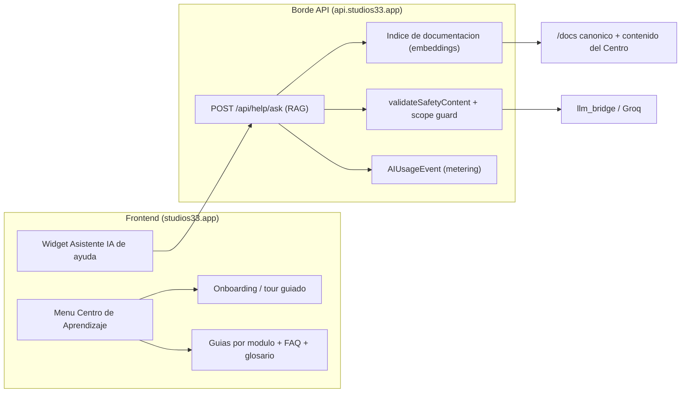

# Plan — Centro de Aprendizaje + Asistente IA de ayuda (app del terapeuta)

> **Objetivo:** dotar a la app del terapeuta (Studios33) de dos piezas de soporte al usuario, **separadas del interprete simbolico**:
> 1. **Centro de Aprendizaje** — un menu/seccion que ensena *como funciona la app* (onboarding, guias por modulo, FAQ, glosario, novedades).
> 2. **Asistente IA de ayuda** — un chatbot anclado en la documentacion de la app que responde dudas de uso ("como hago X?"), distinto del motor de interpretacion clinica/formativa.
>
> **Base:** `main` (hacer `git pull --ff-only origin main` antes de tocar) - prod Hetzner viva (`studios33.app` + `api.studios33.app`) - stack Next.js (BFF) + Django REST + `packages/symbolic` (TS) + LLM via `llm_bridge`/Groq. Lo ejecuta **un agente orquestador con subagentes**.

## Reglas NO negociables

1. El **Asistente IA de ayuda** responde SOLO sobre *como funciona la app* (anclado en `/docs` + contenido del Centro de Aprendizaje). **No** da diagnostico, consejo personal, etiquetas psicologicas ni interpretacion simbolica del consultante. Si la pregunta es clinica/personal, redirige al modulo correspondiente y declina.
2. **Terminos prohibidos** (`validateSafetyContent`): el asistente de ayuda aplica el filtro completo. El **lexico clinico** (diagnostico, trastorno, patologia...) permanece **gated server-side solo para terapeutas medicos/psiquiatras verificados** (`can_use_clinical_lexicon`, fail-safe `observational`); el asistente de ayuda **NO** levanta ese bloqueo ni lo auto-otorga el cliente.
3. **Sin PHI** en prompts, contexto ni logs del asistente. Grounding solo sobre documentacion de producto, nunca sobre datos de pacientes.
4. **Metering** del asistente reutiliza `AIUsageEvent` (provider real groq) — sin crear ruta de coste paralela.
5. **Gobernanza:** contenido de aprendizaje bajo `/docs` canonico; cada decision/endpoint en `.ai-memory/` con su etiqueta (`[DECISION]`/`[ENDPOINT]`/`[SECURITY]`).

## 0. Alcance y partida

**Que existe hoy (reutilizable):**
- Borde API Django REST + BFF Next.js; auth canonico `Authorization: Token <token>`.
- `llm_bridge`/Groq + `AIUsageEvent` (metering por proveedor) + `validateSafetyContent` (terminos prohibidos).
- Documentacion de producto bajo `/docs` (p. ej. `02_CORE_WORKSPACES`, `05_UX_PRINCIPLES`) — fuente para el grounding del asistente.
- Modulos a documentar ya en prod: Arbol de la Vida, Cabala aplicada, Correspondencias (Hermetico<->Judio), Tarot / Tirada del Arbol (`tree_of_life`), Modo Hibrido (Lectura asistida IA + consentimiento SWM v3), Dashboard de metricas del terapeuta.

**Que falta (este plan):**
- **Centro de Aprendizaje** (menu + contenido) — no existe como seccion dedicada.
- **Asistente IA de ayuda** (RAG sobre docs + widget) — distinto del interprete; no existe.

## 1. Arquitectura objetivo



**Principio clave:** el asistente de ayuda es **RAG anclado** (responde citando guias/docs); si no hay grounding suficiente, dice que no lo sabe y enlaza la guia mas cercana — nunca improvisa contenido clinico.

## 2. Workstream L — CENTRO DE APRENDIZAJE

**Meta:** una seccion navegable que ensene a usar la app, con contenido versionado bajo `/docs`.

- [ ] **L1 — Inventario y mapa de contenido.** Listar cada modulo/pantalla y la guia que le corresponde; definir taxonomia (Primeros pasos / Workspaces / Modo Hibrido / Metricas / Seguridad-consentimiento / FAQ / Glosario).
- [ ] **L2 — Entrada y navegacion.** Punto de acceso visible (item "Aprender"/learn en el menu del terapeuta + ruta `/learn`); layout indice -> categoria -> guia; busqueda local.
- [ ] **L3 — Onboarding / tour guiado.** Tour de primer uso (coachmarks) por las zonas clave; reanudable y descartable; estado persistido por usuario (sin PHI).
- [ ] **L4 — Biblioteca de guias.** Render de guias (MDX/markdown) por modulo con capturas/GIFs; i18n ES; cada guia enlaza a la pantalla real. Contenido bajo `/docs` canonico.
- [ ] **L5 — FAQ + Glosario + Novedades.** FAQ de uso; glosario simbolico-estructural (el lexico clinico completo solo se muestra a verificados, via la misma gate server-side); changelog ligero de la app.
- [ ] **L6 — UX y accesibilidad.** Estados loading/empty, responsive, accesibilidad; alinear con `docs/05_UX_PRINCIPLES/`.

## 3. Workstream AI — ASISTENTE IA DE AYUDA

**Meta:** chatbot de soporte de producto, anclado en la documentacion, con seguridad de alcance.

- [ ] **AI1 — Indice de documentacion (grounding).** Pipeline que indexa `/docs` + guias del Centro (chunking + embeddings) con re-indexado al actualizar contenido. Sin datos de pacientes en el indice.
- [ ] **AI2 — Endpoint RAG `POST /api/help/ask`.** Recupera pasajes relevantes, construye prompt acotado a "como funciona la app", llama a `llm_bridge`/Groq, devuelve respuesta **con citas** a las guias; `IsAuthenticated`; metering via `AIUsageEvent`.
- [ ] **AI3 — Guard de alcance + seguridad.** Clasificador/prompt-guard: si la consulta pide diagnostico/consejo/interpretacion del consultante, declina y redirige al modulo (interprete/consentimiento). Salida pasa por `validateSafetyContent`; **no** levanta el lexico clinico; sin PHI en logs.
- [ ] **AI4 — Widget de UI.** Panel/burbuja "Como funciona...?" accesible desde el Centro y desde cualquier pantalla; sugerencias contextuales ("preguntar sobre esta pantalla"); muestra citas y enlaza a la guia completa.
- [ ] **AI5 — Fallback y limites.** Si no hay grounding suficiente -> "no lo se con certeza" + guia mas cercana; rate-limit por usuario; mensajes de error claros.

## 4. Workstream AN — ANALITICA (opcional, no bloqueante)

- [ ] **AN1 — Senales de aprendizaje.** Conteos agregados (sin PII): guias mas vistas, tasa de finalizacion del tour, top de preguntas al asistente, % respondidas con grounding. Reutiliza el patron de `TherapistMetricsView` (solo agregados).

## 5. Asignacion a agentes (anti-colision)

| Agente | Workstreams | Zona del repo | Rama sugerida |
|---|---|---|---|
| Agente L — Frontend/Contenido | L1–L6 | `tonyblanco-app` (rutas `/learn`, componentes) + `/docs` (contenido) | `feat/learning-center` |
| Agente AI — Backend RAG + Widget | AI1–AI5 | borde API (`/api/help/*`), pipeline de indice, widget | `feat/help-assistant` |
| Agente AN — Metricas (opcional) | AN1 | backend agregados + panel | `feat/learning-analytics` |

**Coordinacion:** ramas separadas, PRs pequenos con tests; el contrato del endpoint `POST /api/help/ask` (request/response + formato de citas) se **congela** antes de que el widget lo consuma; cada decision/endpoint en `.ai-memory/`.

## 6. Definition of Done

- [ ] **L** — Centro accesible desde el menu, onboarding funcional, guias por modulo en ES, FAQ + glosario + novedades; contenido bajo `/docs`.
- [ ] **AI** — `POST /api/help/ask` en vivo con grounding + citas; widget integrado; guard de alcance (declina clinico) y `validateSafetyContent` activos; metering en `AIUsageEvent`; sin PHI en logs.
- [ ] **Seguridad** — el asistente nunca emite diagnostico/consejo; lexico clinico sigue gated solo a verificados server-side; tests de "fuera de alcance" y "sin terminos prohibidos" verdes.
- [ ] **Global** — `tsc --noEmit` limpio, suites verdes, `.ai-memory` actualizada, docs bajo `/docs`, smoke en prod.

## 7. Decisiones fijadas (handoff autonomo)

1. **Alcance del asistente:** SOLO ayuda de uso de la app (no interpretacion formativa/clinica) — *decision del usuario, 11 jun*. Para cualquier consulta interpretativa, redirige al interprete simbolico.
2. **Audiencia:** Fase 1 = terapeutas. Variante para consultante/paciente queda como fase 2 opcional (mismo motor, distinto corpus y tono).
3. **Contenido inicial:** partir del contenido existente en `/docs` y completar las guias que falten; no redactar desde cero lo que ya tiene fuente canonica.
4. **RAG:** indice ligero local sobre `/docs` como base (sin dependencia de vector store externo); usar embeddings si ya hay infra, si no, recuperacion keyword/BM25 + re-ranking.

## 8. Riesgos y mitigaciones

| Riesgo | Mitigacion |
|---|---|
| El asistente se desvia a consejo clinico | Guard de alcance + `validateSafetyContent` + grounding obligatorio; declina y redirige |
| Respuestas inventadas (sin base en docs) | RAG con citas; si no hay grounding suficiente -> "no lo se" + guia cercana |
| Fuga de PHI al LLM | Solo se indexa documentacion de producto; nunca datos de pacientes en prompt/log |
| Solapamiento con el interprete simbolico | Separacion de alcance explicita; el asistente redirige al modulo para lo interpretativo |
| Contenido del Centro desactualizado | Contenido versionado en `/docs`; re-indexado del RAG al actualizar guias |

## 9. Handoff — Orquestacion con subagentes

Plan **global y autocontenido**: se entrega a **un solo agente orquestador** que reparte en subagentes (Contenido/Frontend / IA/Backend / QA).

```
PROMPT ORQUESTADOR — Centro de Aprendizaje + Asistente IA de ayuda

Repo: TonyBlanco/analisis_cabalistico_alma (default main). git pull --ff-only origin main antes de tocar.
Ramas: feat/learning-center (Centro) y feat/help-assistant (Asistente). PRs pequenos.

Alcance FIJADO: el asistente responde SOLO sobre como funciona la app (NO interpretacion clinica/formativa). RAG anclado en /docs con citas; sin grounding suficiente -> responde "no lo se con certeza" + enlaza la guia mas cercana. Sin PHI en prompt/indice/logs. Metering via AIUsageEvent. El lexico clinico NO se levanta (sigue gated a medicos/psiquiatras verificados server-side).

Reparte en subagentes:
- SUB-CONTENIDO/FRONT: L1-L6 (menu /learn, onboarding/tour, guias desde /docs, FAQ, glosario, novedades) + AI4-AI5 (widget de ayuda + fallback).
- SUB-IA/BACKEND: AI1 (indice ligero sobre /docs) + AI2 (POST /api/help/ask con citas, IsAuthenticated, metering en AIUsageEvent) + AI3 (guard de alcance + validateSafetyContent).
- SUB-QA: tests de fuera-de-alcance (declina clinico) y sin-terminos-prohibidos; tsc --noEmit; vitest; smoke.

Congela el contrato de /api/help/ask (request/response + formato de citas) antes de que el widget lo consuma. Cada decision/endpoint en .ai-memory/. Reporta de vuelta para verificacion antes de mergear.
```
