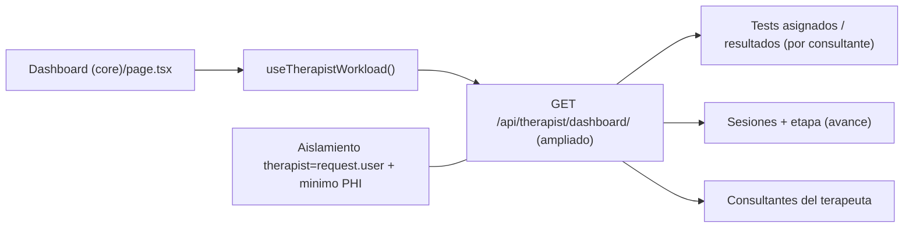

# Plan — Reparar el Dashboard del Terapeuta (tests + avance por consultante)

> **Objetivo:** el Dashboard del Terapeuta hoy esta "desnudo": solo muestra KPIs agregados y consumo IA, pero **no le dice al terapeuta que tests ha enviado, cuales estan pendientes/completados, ni el avance del trabajo con cada consultante**. Antes existia una vista centrada en paciente que quedo desconectada. Este plan **repara y reconstruye** esa informacion operativa.
>
> **Base:** `main` (HEAD actual; hacer `git pull --ff-only origin main` antes de tocar) - prod Hetzner viva (`studios33.app` + `api.studios33.app`) - Next.js (BFF) + Django REST. Lo ejecuta **un agente orquestador con subagentes**.

## Reglas NO negociables

1. **Aislamiento estricto:** el terapeuta solo ve SUS consultantes y SUS tests (`therapist=request.user`). Nunca datos de otros terapeutas.
2. **Minimo PHI:** mostrar estado/avance (enviado, pendiente, completado, etapa, fecha), no contenido clinico sensible innecesario; **sin PHI en logs**.
3. **Lexico clinico** sigue gated server-side solo para terapeutas medicos/psiquiatras verificados (`can_use_clinical_lexicon`); el dashboard **no** lo levanta.
4. **No tocar lineas rojas:** `symbolic_interpreter_ai.py`, `governed_views.py`, `role.ts`, `SafetyRole`, ni `backend/cabala_py/` salvo borde API.
5. **Gobernanza:** cada decision/endpoint en `.ai-memory/`; **contrato de datos congelado** antes de cablear la UI.

## 1. Diagnostico — por que esta "desnudo"

- El dashboard activo `tonyblanco-app/app/(dashboard)/dashboard/therapist/(core)/page.tsx` solo renderiza: **panel de consumo IA** (`useTherapistAIUsage`), **metricas agregadas B7** (`useTherapistMetrics` -> `MetricsDashboard`) y **botones de acciones rapidas**. No hay vista de tests por consultante ni de avance.
- El backend **ya expone** `TherapistDashboardView` (`GET /api/therapist/dashboard/`), `/api/therapist/sessions/` y `/api/therapist/notes/`, pero la auditoria `docs/00_SOURCE_OF_TRUTH/AUDITORIA CABALA APP 12182025.md` los marca **"no consumo detectado"** -> el frontend nunca los cablo.
- La vista antigua centrada en paciente quedo archivada en `tonyblanco-app/_legacy_app_backup/(dashboard)/dashboard/therapist/page.tsx` -> desconectada del flujo actual.
- Incidencias relacionadas: `docs/incidents/2026-01-05-visibility-assigned-tests.md` y `docs/legacy/DASHBOARD-ANTES-DESPUES.md`.

**Causa raiz:** los endpoints de trabajo (dashboard/sessions/notes/tests asignados) **existen pero sin wiring** en el dashboard nuevo; la vista rica anterior fue movida a `_legacy_app_backup` sin un reemplazo equivalente.

## 2. Que debe mostrar el dashboard (objetivo funcional)

- **Mis consultantes (trabajo en curso):** lista/cards con cada consultante activo, su etapa y ultima actividad.
- **Tests por estado:** *enviados* / *pendientes* (sin responder) / *completados*, por consultante y en total; con CTA a resultados.
- **Avance del trabajo:** progreso por consultante (sesiones registradas, etapa de la sesion asistida, % de hitos) y que falta.
- **Pendientes de accion del terapeuta:** tests completados sin revisar, consultantes sin sesion reciente, perfiles incompletos.
- *(Se mantiene)* KPIs agregados B7 + consumo IA, pero **debajo** del trabajo operativo.

## 3. Datos y contrato



## 4. Workstreams

- [x] **D1 — Auditoria + contrato de datos.** Mapear modelos de test assignment/results, sesiones y etapa; definir el *shape* de respuesta (por consultante: tests {enviados, pendientes, completados}, avance, pendientes de accion). Congelar contrato en `.ai-memory/therapist_dashboard_contract.md`.
- [x] **D2 — Backend.** `TherapistDashboardView` ampliado con `workload` via `backend/api/therapist_workload.py`; `IsAuthenticated, IsTherapist`; aislamiento `therapist=request.user`; sin PHI superfluo.
- [x] **D3 — Frontend (seccion operativa).** `TherapistWorkloadSection` + `useTherapistWorkload` en `(core)/page.tsx`, **por encima** de KPIs; badges, progreso y enlaces a ficha/resultados.
- [x] **D4 — Wiring de endpoints huerfanos.** `/dashboard/` cableado; `/sessions/` y `/notes/` documentados (consumo en ficha, no home). Incidencia `2026-01-05-visibility-assigned-tests.md` → RESOLVED.
- [x] **D5 — Estados + UX.** loading/empty/error, `GuidedBlock` vacío, responsive cards/tabla, accesibilidad; sin PHI en logs.
- [x] **D6 — Tests + smoke.** 15 tests workload + 12 metrics + `tsc` + 4 vitest; smoke prod tras deploy (ver §6).

## 5. Reutilizables ya en repo

| Pieza | Ruta | Uso |
|---|---|---|
| Vista antigua (referencia) | `_legacy_app_backup/(dashboard)/dashboard/therapist/page.tsx` | Modelo de la UI rica centrada en paciente |
| `AssignedTestsSection` / `PatientAssignedTestsSection` | `tonyblanco-app/components/` | Listado de tests asignados + CTA a resultados |
| `PatientResultsSection` | `tonyblanco-app/components/` | Resultados por consultante |
| `TherapistClinicalDashboard/` (index, RightPanel, CenterVisual) | `tonyblanco-app/components/` | Layout clinico por secciones (overview) |
| Endpoints backend | `/api/therapist/dashboard/` / `/sessions/` / `/notes/` | Ya existen; cablear o ampliar |

## 6. Definition of Done

- [x] Endpoint del dashboard devuelve, por consultante del terapeuta autenticado, tests {enviados/pendientes/completados} + avance, con **aislamiento** verificado por test (`test_therapist_dashboard_workload`, 15 tests).
- [x] El dashboard `(core)` muestra la seccion operativa por encima de los KPIs; estados loading/empty/error correctos.
- [x] Incidencia `2026-01-05-visibility-assigned-tests.md` cerrada; `/dashboard/` cableado; `/sessions/` y `/notes/` documentados en `.ai-memory/decisions.md`.
- [x] `tsc --noEmit` limpio + suites backend/front verdes + smoke en prod (rama `feat/therapist-dashboard-revamp`, commit `2386f3b1`).
- [x] `.ai-memory/` actualizada (`therapist_dashboard_contract.md`, `api_contracts.md`, `decisions.md`); sin PHI en logs.

## 7. Handoff — Orquestacion con subagentes

Plan **global y autocontenido**: se entrega a **un agente orquestador** que reparte en subagentes (Backend / Frontend / QA).

```
PROMPT ORQUESTADOR — Dashboard del Terapeuta

Repo: TonyBlanco/analisis_cabalistico_alma (default main). git pull --ff-only origin main antes de tocar.
Rama base: feat/therapist-dashboard-revamp. PRs pequenos por workstream.

Problema: el dashboard del terapeuta solo muestra KPIs agregados (B7) + consumo IA. Falta lo operativo: por consultante, tests enviados/pendientes/completados y avance del trabajo. Los endpoints /api/therapist/dashboard/, /sessions/, /notes/ existen pero NO estan cableados (auditoria: "no consumo detectado"). La vista rica anterior esta en _legacy_app_backup/.

Reparte en subagentes:
- SUB-BACKEND: D1 (contrato de datos) + D2 (endpoint con estado de tests y avance por consultante) + D4 (wiring/decision sessions y notes). Aislamiento therapist=request.user; sin PHI superfluo.
- SUB-FRONTEND: D3 (seccion Mis consultantes / Trabajo en curso en (core)/page.tsx, por encima de los KPIs) + D5 (loading/empty/error, UX, accesibilidad). Reutiliza AssignedTestsSection / PatientAssignedTestsSection / PatientResultsSection / TherapistClinicalDashboard.
- SUB-QA: D6 (tests backend de aislamiento/forma/sin PII/estados; tsc --noEmit; vitest; smoke en prod).

Reglas no negociables: aislamiento estricto; lexico clinico solo verificados server-side (no lo levanta el dashboard); no tocar symbolic_interpreter_ai.py / governed_views.py / role.ts / SafetyRole salvo borde API; cada decision/endpoint en .ai-memory/.
Congela el contrato de datos (D1) antes de que SUB-FRONTEND cablee la UI.
DoD: endpoint con aislamiento + seccion operativa visible + incidencia 2026-01-05-visibility-assigned-tests.md cerrada + suites verdes + smoke OK. Reporta de vuelta para verificacion antes de mergear.
```

## 8. Riesgos y mitigaciones

| Riesgo | Mitigacion |
|---|---|
| Fuga de datos entre terapeutas | Filtro `therapist=request.user` + test de aislamiento obligatorio |
| Exponer PHI de mas en la lista | Mostrar solo estado/avance; detalle clinico tras entrar a la ficha |
| Reintroducir bugs del dashboard legacy | Usar `_legacy_app_backup` solo como referencia visual, no copiar tal cual |
| Endpoints huerfanos sin decidir | D4 obliga a consumir o deprecar con nota en `.ai-memory/` |
