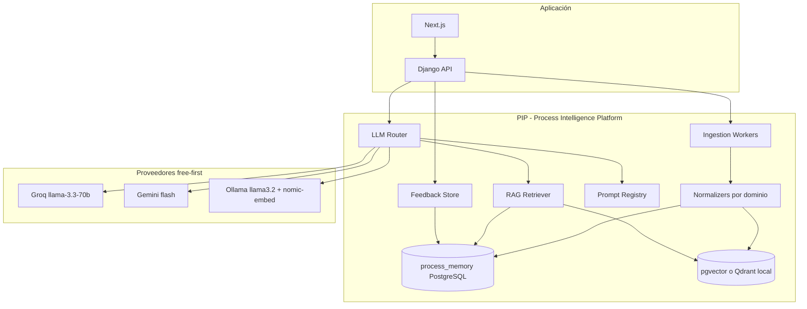

# planai.md — Sistema LLM que aprende de los procesos

**Rol:** Arquitectura de ingeniería para *Holística Aplicada / Studios33*  
**Fecha:** 2026-06-05  
**Auditoría base:** [docs/01_PROJECT_STATE/AUDIT_MODULOS_IA_2026-06-05.md](docs/01_PROJECT_STATE/AUDIT_MODULOS_IA_2026-06-05.md)  
**Principio:** *Aprender del proceso* ≠ *entrenar un LLM desde cero*. Primero capturar, estructurar y reutilizar; luego RAG y feedback; fine-tune solo si hay volumen y compliance.

---

## 1. Objetivo

Construir una **Plataforma de Inteligencia de Proceso (PIP)** que:

1. **Observa** cada flujo clínico/simbólico (tests, SWM, bioemocional, cábala, tarot) al cerrarse o validarse.
2. **Resume** en artefactos estructurados (JSON + embeddings) sin PHI innecesaria.
3. **Asiste** al terapeuta con contexto **derivado de sus propios casos** (RAG + reglas), no diagnósticos automáticos.
4. **Mejora** con señales humanas (validar hipótesis, sellar workspace, revisar lectura IA).
5. Usa **recursos gratuitos** en Hetzner: Groq, Gemini free tier, **Ollama local** (inferencia + embeddings).

**Fuera de alcance v1:** fine-tuning de LLM en el servidor; diagnóstico clínico automatizado; IA en frontend.

---

## 2. Estado actual (resumen)

| Capacidad | Existe | Gap |
|-----------|--------|-----|
| Multi-proveedor IA | `multi_ai_service.py` + `llm_bridge` | Astrología/tarot holístico aún Direct |
| **Metering / billing IA** | Spec 2026-06-10 | [AI_USAGE_METERING_IMPLEMENTATION.md](docs/01_PROJECT_STATE/AI_USAGE_METERING_IMPLEMENTATION.md) — código pendiente |
| Persistencia proceso | SWM artifacts, bioemotional DB, AnalysisRecord | Sin índice unificado ni embeddings |
| Gobernanza simbólica | SWM v3 docs, contratos | No aplicada a todos los endpoints IA |
| Aprendizaje | — | Cero feedback loop |
| Ollama en prod | Config only | No instalado |

---

## 3. Arquitectura objetivo



### 3.1 Capas

| Capa | Responsabilidad |
|------|-----------------|
| **Ingestion** | Señales al `seal`, `validate`, `close session`, `AnalysisRecord` complete |
| **Normalizers** | Un JSON `ProcessSnapshot` por dominio (kabbalah, bioemotion, tarot, clinical_test) |
| **Memory** | Tablas `process_event`, `process_snapshot`, `embedding_chunk` |
| **RAG** | Recuperar top-k chunks por `patient_id` + `domain` + terapeuta (ownership) |
| **Router** | `AI_PROVIDER=free_first`: Groq → Gemini → Ollama |
| **Prompt registry** | YAML en repo: `backend/ai/prompts/planai_agent_core_v1.yaml` (+ tareas por lane) |
| **Feedback** | `therapist_rating`, `edited_text`, `rejected` → pesos futuros RAG |

---

## 4. Modelos recomendados (sin entrenar)

### 4.1 Matriz free-first (servidor + APIs)

| Tarea | Modelo | Dónde | Por qué |
|-------|--------|-------|---------|
| **Chat / síntesis corta** | `llama-3.3-70b-versatile` | Groq API | Free tier, rápido, español aceptable |
| **Contexto largo / JSON estricto** | `gemini-1.5-flash` o `gemini-2.0-flash` | Google API | Ventana grande, ya integrado |
| **Fallback offline / privacidad** | `llama3.2:3b` | Ollama Hetzner | $0, datos no salen del servidor |
| **Embeddings RAG** | `nomic-embed-text` | Ollama | Free, local, 768-dim |
| **Cábala determinista** | — | `swm/cabala/services/*` | **No LLM** para números/árbol |
| **Bioemocional léxico** | — | DB dictionary | LLM solo para **redacción** de síntesis validada |

### 4.2 ¿Cuándo entrenar?

| Condición | Acción |
|-----------|--------|
| < 500 procesos sellados | **No entrenar** — solo prompts + RAG |
| 500–5000 con feedback | Evaluar **LoRA** en modelo 7B vía servicio externo (RunPod) o adapter Ollama Modelfile |
| > 5000 + auditoría legal | Dataset anonimizado + fine-tune **simbólico** separado del clínico |

**Dominios separados obligatorio:**

- `model_lane=symbolic` → cábala, tarot, transgeneracional  
- `model_lane=clinical_support` → bioemocional redacción, MSHE (solo educativo)  
- **Nunca** mezclar lanes en un solo fine-tune.

---

## 5. Aprendizaje “de los procesos” — mecanismos

### 5.1 Qué capturar (eventos)

| Evento fuente | Trigger | Campos clave |
|---------------|---------|--------------|
| `swm.tarot.sealed` | POST seal | spread JSON, patient_id, therapist_id |
| `swm.cabala.completed` | session close | TreeStructuralState snapshot |
| `swm.mcmi4.sealed` | seal | axes, questionnaire scores |
| `bioemotional.synthesis.closed` | PATCH close | themes, dictionary refs |
| `bioemotional.hypothesis.validated` | PATCH validate | text before/after |
| `analysis_record.executed` | execute adapter | kind, computed_result hash |
| `ai.tarot.interpretation` | POST interpret | prompt_hash, output, edited_by_user? |

### 5.2 ProcessSnapshot (esquema unificado)

```json
{
  "id": "uuid",
  "domain": "kabbalah|bioemotion|tarot|clinical|astrology",
  "lane": "symbolic|clinical_support",
  "patient_id": "uuid",
  "therapist_id": "uuid",
  "source_type": "swm_tarot|bioemotional_synthesis|analysis_record",
  "source_id": "uuid",
  "structured": {},
  "text_summary": "max 2kb therapist-safe",
  "created_at": "iso8601",
  "consent_scope": "store_with_consent|no_store"
}
```

### 5.3 Cómo “aprende” sin training

1. **RAG:** nuevas asistencias incluyen chunks de procesos similares del **mismo terapeuta** (o global anonimizado si consent).  
2. **Prompt tuning manual:** versionar prompts cuando feedback negativo > 30%.  
3. **Ranking:** subir peso a chunks con `therapist_rating >= 4`.  
4. **Eval harness:** golden set de 50 casos sintéticos + regresión de guardrails (14 términos prohibidos SWM v3).

---

## 6. Dominios: Cábala y bioemoción

### 6.1 Cábala (kabbalah lane)

| Componente | Implementación |
|------------|----------------|
| Motor números/árbol | Mantener **100% determinista** (`tree_calculator`, `comprehensive_engine`) |
| IA | Solo **interpretación educativa** post-`TreeStructuralState` |
| Contexto RAG | Sefaria refs curadas + snapshots sellados del paciente |
| Prompt | `backend/ai/prompts/kabbalah_interpret_v1.yaml` — tono arquetípico, no predictivo |
| API nueva | `POST /api/ai/kabbalah/interpret/` → router + RAG + consent |

### 6.2 Bioemoción (clinical_support lane)

| Componente | Implementación |
|------------|----------------|
| Core | Diccionario + observations + hypotheses (sin IA hoy) |
| IA v1 | `POST /api/bioemotional/synthesis/{id}/assist-draft/` — borrador **no publicado** |
| Humano en el loop | Terapeuta edita y `publish`; solo entonces ingesta a `process_memory` |
| RAG | Entradas diccionario + hipótesis validadas del paciente |
| Prompt | `backend/ai/prompts/bioemotional_draft_v1.yaml` — fenomenológico, no DSM |

---

## 7. Plan por fases (DAG)

### Fase 0 — Unificación IA (2–3 días) ✅

**Especificación:** [docs/01_PROJECT_STATE/planai/PHASE_0_UNIFIED_LLM_ROUTER.md](docs/01_PROJECT_STATE/planai/PHASE_0_UNIFIED_LLM_ROUTER.md)

- [x] Refactor: `holistic_ai`, `tarot_service`, `symbolic_interpreter_ai`, MSHE → `generate_with_fallback()` (vía `llm_bridge`)
- [x] Endpoint `GET /api/ai/status/` (providers disponibles, latencia última llamada)
- [x] Tests unitarios prompts/router (`test_ai_llm_bridge`, `test_planai_prompt_registry`)
- [ ] Limpiar API key de `docs/technical/README_AI.md`

**Criterio de salida:** Tarot + holistic funcionan si solo hay `GROQ_API_KEY`.

### Fase 1 — Process Memory + RAG (1–2 semanas) 🟡 base implementada

- [x] Módulo `api/process_memory/`
- [x] Migraciones: `process_event`, `process_snapshot`, `embedding_chunk`
- [x] Ingestion signals (Django signals post-save en bio synthesis close y `AnalysisRecord`)
- [ ] Wiring directo del seal SWM Tarot al servicio `ingest_tarot_seal()`
- [ ] Instalar Ollama en Hetzner + `docker compose` sidecar o host service
- [ ] pgvector en `studio33_db` **o** Qdrant container en `studio33_net`
- [ ] Job: embed `text_summary` con `nomic-embed-text`
- [x] `RAGService.retrieve(patient_id, domain, query)` con ownership check y ranking lexical v1

**Criterio de salida:** Terapeuta ve “contexto de procesos previos” en panel Tarot (read-only).

### Fase 2 — Asistencia gobernada (1–2 semanas) ✅ (core)

**Especificación:** [docs/01_PROJECT_STATE/planai/PHASE_2_GOVERNED_ASSISTANCE.md](docs/01_PROJECT_STATE/planai/PHASE_2_GOVERNED_ASSISTANCE.md)  
**Prompts:** `kabbalah_interpret_v1.yaml`, `bioemotional_draft_v1.yaml`, `planai_agent_core_v1.yaml` → `api/ai/prompt_registry.py`

- [x] `POST /api/ai/kabbalah/interpret/` con TreeStructuralState input (lane `symbolic`)
- [x] Bioemocional draft assist (no auto-publish) — lane `clinical_support`
- [x] Feedback API: `POST /api/ai/feedback/` (rating, correction text)
- [ ] Actualizar pesos RAG desde feedback (Fase 1)
- [x] Feature flags: `AI_KABBALAH_ENABLED`, `AI_BIOEMOTION_DRAFT_ENABLED`

**Criterio de salida:** 0 violaciones en eval harness 50 casos → `api.tests.test_planai_eval_harness` + `planai_eval_cases.py` (50 casos).

### Fase 3 — Observabilidad y coste (3–5 días)

- [ ] Log estructurado: provider, tokens, latency, `process_snapshot_id`
- [ ] Cuota diaria Groq/Gemini en settings
- [ ] Dashboard admin: llamadas IA / día

### Fase 4 — Evaluación entrenamiento (solo si Fase 2 OK)

- [ ] Export CSV anonimizado `process_snapshot` + feedback
- [ ] Informe: ¿merece LoRA? (métricas BLEU/ROUGE + guardrails)
- [ ] **No ejecutar fine-tune** sin sign-off [AUDITORIA CABALA APP](../docs/00_SOURCE_OF_TRUTH/AUDITORIA%20CABALA%20APP%2012182025.md)

---

## 8. Despliegue en Hetzner (free resources)

```bash
# Ollama en host (ejemplo)
curl -fsSL https://ollama.com/install.sh | sh
ollama pull llama3.2:3b
ollama pull nomic-embed-text

# En /opt/studio33/.env
OLLAMA_BASE_URL=http://host.docker.internal:11434  # o IP host desde studio33_api
AI_PROVIDER=free_first
GROQ_API_KEY=...
GEMINI_API_KEY=...
```

**Docker opcional** (`docker-compose.studios33.yml`):

```yaml
  studio33_ollama:
    image: ollama/ollama:latest
    networks: [studio33_net]
    volumes: [ollama_data:/root/.ollama]
    deploy:
      resources:
        limits:
          memory: 6G
```

Ajustar `studio33_api` workers: **2** si Ollama usa 4–6 GB RAM.

---

## 9. Gobernanza y compliance

| Regla | Implementación |
|-------|----------------|
| No diagnóstico | Validador post-LLM (lista términos + regex) — reutilizar SWM v3 |
| Consentimiento | `UserProfile` / `holistic_ai_consent` antes de RAG cross-session |
| PHI mínima | `text_summary` sin nombre; IDs internos only |
| lane separation | Router rechaza mezclar prompts clinical ↔ symbolic |
| Audit | `FederationAuditLog` pattern para cada llamada IA |

---

## 10. Wiring pendiente (bloquea PIP)

Estos ítems del [audit](docs/01_PROJECT_STATE/AUDIT_MODULOS_IA_2026-06-05.md) deben avanzar en paralelo a Fase 0–1:

1. Sincronizar `clinicalTests.registry.ts`  
2. Unificar rutas Tarot frontend  
3. Conectar dashboards a `AnalysisRecord` donde aún hay placeholders  
4. Decidir AISymbolic: descongelar bajo SWM v3 o eliminar ruta  

---

## 11. Métricas de éxito (90 días)

| Métrica | Objetivo |
|---------|----------|
| % llamadas IA vía router unificado | 100% |
| Procesos con snapshot ingerido | > 60% de seals/closes |
| Latencia p95 Groq | < 8 s |
| Coste mensual IA | < $20 (resto Ollama) |
| Feedback terapeuta capturado | > 40% de asistencias IA |
| Incidentes guardrail | 0 en producción |

---

## 12. Decisión arquitectónica (ADR corto)

**ADR-PIP-001:** El sistema “aprende” mediante **memoria de proceso estructurada + RAG + feedback**, no mediante fine-tuning en Hetzner, hasta contar con >500 procesos validados y auditoría de datos.

**ADR-PIP-004 (v1):** Queda **prohibido** en el repo PIP v1: fine-tuning, LoRA, PEFT, custom training loops y model checkpoints. Solo inferencia + almacenamiento de feedback.

**ADR-PIP-002:** Orden de proveedores **Groq → Gemini → Ollama** para minimizar coste; Gemini reservado para contexto >8k tokens.

**ADR-PIP-003:** Cábala y bioemoción mantienen **motores deterministas**; el LLM solo redacta capa interpretativa/educativa bajo contrato.

---

## 13. Próximo paso inmediato

1. Aprobar este plan (o acotar fases).  
2. Ejecutar **Fase 0** (unificar `multi_ai_service`).  
3. Crear rama `feature/process-memory` para Fase 1.  

**Owner sugerido:** backend Django + 1 PR frontend (panel contexto RAG en therapist workspace).

---

---

## 14. Estado de despliegue (2026-06-05)

| Ítem | Estado |
|------|--------|
| Fase 0–2 código | ✅ En `main` (commits PIP + tests) |
| Prod `studio33_api` | ✅ Rebuild + recreate Hetzner |
| `GET /api/ai/status/` | ✅ `free_first`, `training.*` false |
| Tests 35 + harness 50 | ✅ Servidor + CI `pip-ai-tests.yml` |
| Fase 1 RAG | 🟡 Base implementada (`api/process_memory/`); pendiente embeddings/vector DB |

*Documento vivo. Actualizar al cerrar cada fase.*
